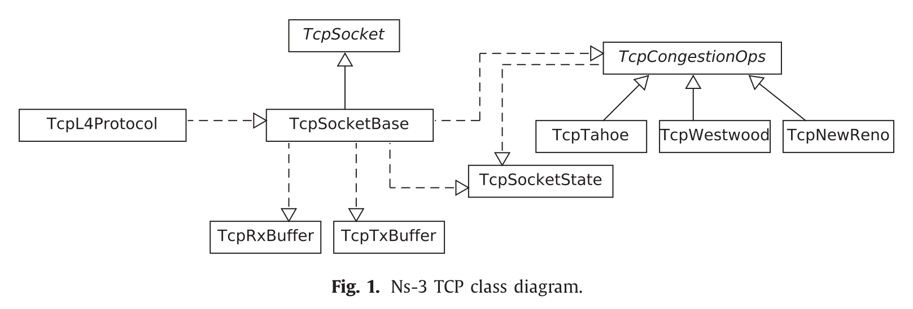

# 内容来源

> 本篇文章内容来自于[Next-generation TCP for ns-3 simulator](<https://www.sciencedirect.com/science/article/pii/S1569190X15300939>)，是NS3官方团队发表的论文，详细介绍了NS3网络模拟器的整体设计思路。

# 设计思路

Linux和NS3的接口非常相似，这允许将拥塞控制从Linux移植到NS3当中，相反亦然。

在之前，拥塞控制被当做一个独立的`TCP`代码。使用软件工程的术语来说，TCP和含有拥塞控制的TCP是一种继承关系，比如`TcpNewReno`和主TCP类`TcpSocketBase`，逻辑上暗示“前者是一种后者”"。后来，人们考虑改变这种范式，试图将其变为“后者使用前者作为一个拥塞控制算法”，即避免这些类之间的继承关系，并且实现了一种接口用来在拥塞控制算法与socket之间交换信息（一种典型的做法即为Linux中的实现）。

另一个相关的更新就是在`TcpSocketBase`引入了**快速重传**和**快速恢复**，

TCP模块被包含在Internet模块中，包含很多互相交互的类，这些类的关系如下图所示，其中：

- 实线表示继承关系。
- 虚线表示调用了API。

比如，`TcpSocketBase`使用了` TcpSocketState`来存储相关的状态。