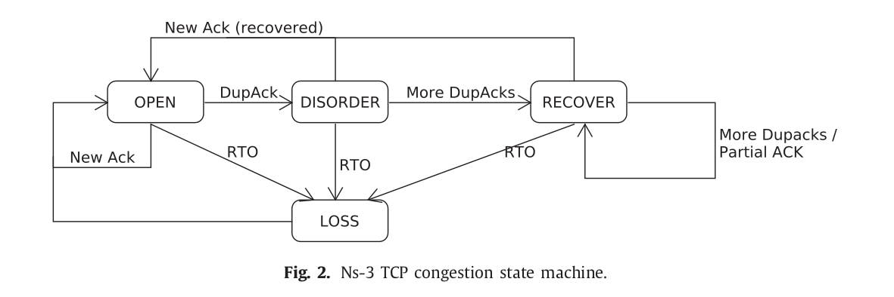

# 内容来源

> 本篇文章内容来自于[Next-generation TCP for ns-3 simulator](<https://www.sciencedirect.com/science/article/pii/S1569190X15300939>)，是NS3官方团队发表的论文，详细介绍了NS3网络模拟器的整体设计思路。

# 设计思路

Linux和NS3的接口非常相似，这允许将拥塞控制从Linux移植到NS3当中，相反亦然。

在之前，拥塞控制被当做一个独立的`TCP`代码。使用软件工程的术语来说，TCP和含有拥塞控制的TCP是一种继承关系，比如`TcpNewReno`和主TCP类`TcpSocketBase`，逻辑上暗示“前者是一种后者”"。后来，人们考虑改变这种范式，试图将其变为“后者使用前者作为一个拥塞控制算法”，即避免这些类之间的继承关系，并且实现了一种接口用来在拥塞控制算法与socket之间交换信息（一种典型的做法即为Linux中的实现）。

另一个相关的更新就是在`TcpSocketBase`引入了**快速重传**和**快速恢复**，

TCP模块被包含在Internet模块中，包含很多互相交互的类，这些类的关系如下图所示，其中：

- 实线表示继承关系。
- 虚线表示调用了API。

比如，`TcpSocketBase`使用了` TcpSocketState`来存储相关的状态。这些状态包括最近使用的变量比如拥塞窗口、慢启动阈值等等。这种状态叫做传输控制块（Transmission Control Block）。

## TcpL4Protocol

通俗来讲，当一个包在IP层被接收到时，这个包会被传输到一个单一的TcpL4Protocol实例当中，然后这个实例才会将这个包传递给正确的Socket（通过在可用的Socket中进行查表），这个可以被理解成为一个在TCP Socket与网络层的接口，它也执行一些耗时的工作比如校验和。

## TCP State Machine

在不同的TCP实现中，这可能是最相同的部分，因为它通过有限的状态和转移定义了TCP协议。在NS3中，包含了一个成员变量叫做m_state，并且它暴露给用户写的脚本中一个只读的可追溯的值，当前的状态取决于之前执行的动作和之前接收到的段。受限于空间限制，我们将不会分析每一个转移，因为他们已经在RFC 793和其他手册中详细地得到了定义。详细的状态转移请参考[TCP传输控制协议](https://tristone13th.github.io/archivers/TCP%E4%BC%A0%E8%BE%93%E6%8E%A7%E5%88%B6%E5%8D%8F%E8%AE%AE)。

## Congestion Control Engine

另外一个关键点是拥塞控制引擎，它被两个不同的模块组成，一个是可插拔的**拥塞控制模块设备**（类`TcpCongestionOps`和它的子类）和另外一个**拥塞状态机**。这些思想被从Linux TCP实现中借用过来。

拥塞状态机，其功能在于确定发送方动作当ACK到达时。状态和动作的命名与Linux中的惯例相同。简单来说：

- 当一个连接打开时，所有端到端的端都处于`OPEN`状态。
- 如果冗余的ACK被接收到，最佳状态是底层网络正在重组包，状态被设置为`DISORDER`。
- 当冗余的ACK达到一个提前设定好的阈值后（一般来说是3），状态被设置为`RECOVERY`，并且开始快重传。每当从猜测到的丢失以来所有发送的段被正确地确认时，状态机返回到`OPEN`状态。
- 在这些状态中的任何一个状态，如果重传超时触发，则切换到`LOSS`状态并尝试恢复。

拥塞控制和慢启动阈值管理被下放到TcpCongestionOps的子类，这和Linux内核中的名为tcp_congestion_ops的结构类似。这种特殊情况允许开发人员轻松地直接从Linux移植拥塞控制。

**当特定的情况发生时（在一个丢包发生后、或在一个新的ACK接收到后），Socket会询问拥塞控制根据规则去做两个变量的更新。**举个例子，当检测到一个丢包发生后，一个新的慢启动阈值被需要，这就取决于拥塞控制算法了（NewReno, Westwood）。

