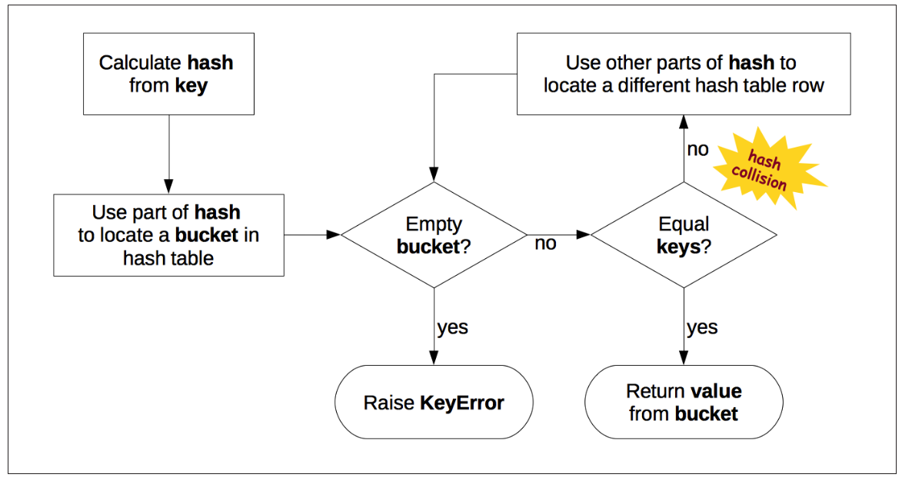
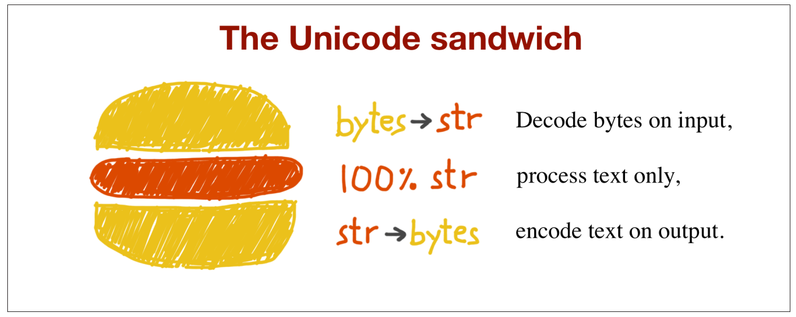

# 序列

## 内建序列

标准库提供了一个丰富的序列类型选择：

**Container sequences**包括`list`, `tuple`, `collections.deque`能够包含不同的类型。

**Flat sequences**包括`str`, `bytes`, `bytearray`, `memoryview`, `array.array`只能包含相同的类型。

Container sequences保存着对于其中元素的引用，这些引用能够是任何的类型；然而flat sequences在他自己的空间中物理存储了其中每个元素的值，后者更加紧凑，然而却被限制了只能存储相同的值。

**Mutable sequences**包括`list`, `bytearray`, `array.array`, `collections.deque` 和 `memoryview`，这些序列是可以改变的。

**Immutable sequences**包括`tuple`, `str` and `bytes`，这些序列是无法改变的。

## 递推式列表和生成器表达式

**递推式列表**（List Comprehension）和**生成器表达式**（generator expression）都是很快速的构建一个序列的方式。

### 递推式列表

递推式列表可以简写为Listcomp。

#### 递推式列表改进

在原来的Python2的版本中，递推式列表有一个很大的缺陷，如下：

```python
Python 2.7.6 (default, Mar 22 2014, 22:59:38)
[GCC 4.8.2] on linux2
Type "help", "copyright", "credits" or "license" for more information.
>>> x = 'my precious'
>>> dummy = [x for x in 'ABC']
>>> x
'C'
```

在这个例子中，`x`的值被更改了。

而在`Python3`中，递推式列表和生成器表达式有了自己的本地域，就像函数一样。而且本地的变量不会掩盖外部的变量。如下：

```python
>>> x = 'ABC'
>>> dummy = [ord(x) for x in x]
>>> x
'ABC'
>>> dummy
[65, 66, 67]
```

### 生成器表达式

生成器表达式可以简写为Genexp。

生成器表达式和递推式列表使用了相同的语法，**但是它是包含在圆括号中而非方括号中**。

**Genexp的优点在于更加节省内存**，因为它使用迭代器协议一个又一个地向外yield元素，而不是直接建立一个列表。

```python
>>> symbols = '$¢£¥€¤'
>>> tuple(ord(symbol) for symbol in symbols)
(36, 162, 163, 165, 8364, 164)
>>> import array
>>> array.array('I', (ord(symbol) for symbol in symbols))
array('I', [36, 162, 163, 165, 8364, 164])
```

如果它是一个函数调用中单一的参数，那就没有必要再写冗余的括号了，**就像上面代码中的第二行**。

## 元组不只是不可更改的列表

元组不只是不可更改的列表，它还可以是没有域名的纪录。

### 作为纪录的元组

请看下面的例子：

```python
>>> traveler_ids = [('USA', '31195855'), ('BRA', 'CE342567'),
... ('ESP', 'XDA205856')]
>>> for country, _ in traveler_ids:
... 	print(country)
USA
BRA
ESP
```

在for循环中，其知道怎样将元组拆开取出其中的数据，这种机制叫做unpacking，我们不关心第二个变量，所以把它置为了哑变量。

### Tuple Unpacking

这个机制工作于任何**可以迭代**的对象。我们可以使用*来得到任何溢出的元素，例子如下：

```python
>>> a, b, *rest = range(5)
>>> a, b, rest
(0, 1, [2, 3, 4])
>>> a, b, *rest = range(3)
>>> a, b, rest
(0, 1, [2])
>>> a, b, *rest = range(2)
>>> a, b, rest
(0, 1, [])
```

这个星星前缀很神奇，它可以放在任何一个位置。

```python
>>> a, *body, c, d = range(5)
>>> a, body, c, d
(0, [1, 2], 3, 4)
>>> *head, b, c, d = range(5)
>>> head, b, c, d
([0, 1], 2, 3, 4)
```

### 嵌套的Tuple Unpacking

请看下面的例子：

```python
metro_areas = (
    ('Tokyo', 'JP', 36.933, (35.689722, 139.691667)),
    ('Delhi NCR', 'IN', 21.935, (28.613889, 77.208889)),
    ('Mexico City', 'MX', 20.142, (19.433333, -99.133333)),
    ('New York-Newark', 'US', 20.104, (40.808611, -74.020386)),
    ('Sao Paulo', 'BR', 19.649, (-23.547778, -46.635833)),
)

for name, cc, pop, (latitude, longitude) in metro_areas:
    pass
```

其中，通过赋予最后一个域一个元组，我们unpack了坐标。

### Named tuples

在`collections.namedtuple`函数中，提供了一个加强的元组，这个元组有了自己的名字和类。

> namedtuple和普通的tuple占用空间完全相同，因为名字被存储在了类中。

举个例子：

```python
>>> from collections import namedtuple
>>> City = namedtuple('City', 'name country population coordinates')
>>> tokyo = City('Tokyo', 'JP', 36.933, (35.689722, 139.691667))
>>> tokyo
City(name='Tokyo', country='JP', population=36.933, coordinates=(35.689722, 139.691667))
>>> tokyo.population
36.933
>>> tokyo.coordinates
(35.689722, 139.691667)
>>> tokyo[1]
'JP'
```

## 切片

列表、元组、字符串等序列类型的一个共有特性是都支持切片操作。

### 为什么切片和区间将最后一个元素排除在外

- 很容易看到切片或者区间的长度，当只给出截至的项时。`range(3)`和`my_list[:3]`都只生产三个元素。
- 很容易计算切片或者区间的长度，直接使用stop减去start。
- 当分成多部份时，不会出现区间交叉的情况。

### 切片对象

一个有趣的例子：

```python
>>> s = 'bicycle'
>>> s[::3]
'bye'
>>> s[::-1]
'elcycib'
>>> s[::-2]
'eccb'
```

其实，切片也是一个对象，也可以对它进行命名，它允许我们更加灵活地使用切片而不是硬编码切片。请看下面的例子：

```python
>>> invoice = """
... 0.....6.................................40........52...55........
... 1909 Pimoroni PiBrella $17.50 3 $52.50
... 1489 6mm Tactile Switch x20 $4.95 2 $9.90
... 1510 Panavise Jr. - PV-201 $28.00 1 $28.00
... 1601 PiTFT Mini Kit 320x240 $34.95 1 $34.95
... """
>>> SKU = slice(0, 6)
>>> DESCRIPTION = slice(6, 40)
>>> UNIT_PRICE = slice(40, 52)
>>> QUANTITY = slice(52, 55)
>>> ITEM_TOTAL = slice(55, None)
>>> line_items = invoice.split('\n')[2:]
>>> for item in line_items:
... 	print(item[UNIT_PRICE], item[DESCRIPTION])
...
$17.50 Pimoroni PiBrella
$4.95 6mm Tactile Switch x20
$28.00 Panavise Jr. - PV-201
$34.95 PiTFT Mini Kit 320x240
```

### 对切片赋值

可更改的序列可以通过切片来更改，可以直接使用赋值，代码如下：

```python 
>>> l = list(range(10))
>>> l
[0, 1, 2, 3, 4, 5, 6, 7, 8, 9]
>>> l[2:5] = [20, 30]
>>> l
[0, 1, 20, 30, 5, 6, 7, 8, 9]
>>> del l[5:7]
>>> l
[0, 1, 20, 30, 5, 8, 9]
>>> l[3::2] = [11, 22]
>>> l
[0, 1, 20, 11, 5, 22, 9]
>>> l[2:5] = 100
Traceback (most recent call last):
File "<stdin>", line 1, in <module>
TypeError: can only assign an iterable
>>> l[2:5] = [100]
>>> l
[0, 1, 100, 22, 9]
```

## 对列表使用操作符

对于乘号，我们可以使用下面的代码进行测验：

```python
>>> l = [1, 2, 3]
>>> l * 5
[1, 2, 3, 1, 2, 3, 1, 2, 3, 1, 2, 3, 1, 2, 3]
>>> 5 * 'abcd'
'abcdabcdabcdabcdabcd'
```

对于加号，可以使用下面的代码进行测验：

```python
>>> a = [1, 2]
>>> b = [3, 4]
>>> print(a + b)
[1, 2, 3, 4]
```

不管是加号还是乘号，都会直接创造出一个新对象，并且不会更改它们的参数。

### 构建列表的列表（大雾）

有时候我们需要使用固定数量的嵌套列表初始化一个列表，比如下面这个例子：

```python
>>> board = [['_'] * 3 for i in range(3)]
>>> board
[['_', '_', '_'], ['_', '_', '_'], ['_', '_', '_']]
>>> board[1][2] = 'X'
>>> board
[['_', '_', '_'], ['_', '_', 'X'], ['_', '_', '_']]
```

一个错误的用法是：

```python
>>> weird_board = [['_'] * 3] * 3
>>> weird_board
[['_', '_', '_'], ['_', '_', '_'], ['_', '_', '_']]
>>> weird_board[1][2] = 'O'
>>> weird_board
[['_', '_', 'O'], ['_', '_', 'O'], ['_', '_', 'O']]
```

另一个错误的用法是：

```python
row = ['_'] * 3
board = []
for i in range(3):
	board.append(row)
```

正确的用法是：

```python
>>> board = []
>>> for i in range(3):
... 	row = ['_'] * 3 #
... 	board.append(row)
...
>>> board
[['_', '_', '_'], ['_', '_', '_'], ['_', '_', '_']]
>>> board[2][0] = 'X'
>>> board #
[['_', '_', '_'], ['_', '_', '_'], ['X', '_', '_']]
```

## 序列增广赋值

符号`+=`和符号`*=`表现非常不同，下面开始讨论：

能够让`+=`运行的特殊函数是`__iadd__`，然而，如果`__iadd__`没有被实现，Python会转而调用函数`__add__`，考虑下面的表达式：

```python
>>> a += b
```

如果a实现了`__iadd__`方法，那么它就会被调用。如果没有，那么会按照`a = a + b`来调用`a + b`，这将会创造一个新的对象并赋予a。请看下面这个例子：

```python
>>> l = [1, 2, 3]
>>> id(l)
4311953800
>>> l *= 2
>>> l
[1, 2, 3, 1, 2, 3]
>>> id(l)
4311953800
>>> t = (1, 2, 3)
>>> id(t)
4312681568
>>> t *= 2
>>> id(t)
4301348296
```

### +=赋值谜题

下面让我们来讨论元组不可变中的奥秘。

```python
>>> t = (1, 2, [30, 40])
>>> t[2] += [50, 60]
Traceback (most recent call last):
File "<stdin>", line 1, in <module>
TypeError: 'tuple' object does not support item assignment
>>> t
(1, 2, [30, 40, 50, 60])
```

简单来说，第一步赋值成功了，第二次写回的赋值失败了。

## 排序内置函数

```python
>>> fruits = ['grape', 'raspberry', 'apple', 'banana']
>>> sorted(fruits)
['apple', 'banana', 'grape', 'raspberry']
>>> fruits
['grape', 'raspberry', 'apple', 'banana']
>>> sorted(fruits, reverse=True)
['raspberry', 'grape', 'banana', 'apple']
>>> sorted(fruits, key=len)
['grape', 'apple', 'banana', 'raspberry']
>>> sorted(fruits, key=len, reverse=True)
['raspberry', 'banana', 'grape', 'apple']
>>> fruits
['grape', 'raspberry', 'apple', 'banana']
>>> fruits.sort()
>>> fruits
['apple', 'banana', 'grape', 'raspberry']
```

使用sorted函数会创造一个新的对象，而使用内置的sort()函数会直接进行内置的排序。

## 管理排好序的序列

`bisect`模块提供两个主要的函数：`bisect`和`insort`。

### 使用bisect搜索

`bisect(haystack, needle)`对`needle`在`haystack`中进行一次查找，后者必须是一个有序序列。

这个函数不止可以用作搜索，也可以用作插入：

```python
import bisect
import random
SIZE = 7
random.seed(1729)
my_list = []
for i in range(SIZE):
    new_item = random.randrange(SIZE*2)
    bisect.insort(my_list, new_item)
    print('%2d ->' % new_item, my_list)
```

我们看到的这么多应用在列表中的其实也应用于其他序列类型。

## 当不只是列表

### 数组（Arrays）

```python
>>> from array import array
>>> from random import random
>>> floats = array('d', (random() for i in range(10**7)))
>>> floats[-1]
0.07802343889111107
>>> fp = open('floats.bin', 'wb')
>>> floats.tofile(fp)
>>> fp.close()
>>> floats2 = array('d')
>>> fp = open('floats.bin', 'rb')
>>> floats2.fromfile(fp, 10**7)
>>> fp.close()
>>> floats2[-1]
0.07802343889111107
>>> floats2 == floats
True
```

### Deques and other queues

Deque代表双向队列，请看下面代码：

```python
>>> from collections import deque
>>> dq = deque(range(10), maxlen=10)
>>> dq
deque([0, 1, 2, 3, 4, 5, 6, 7, 8, 9], maxlen=10)
>>> dq.rotate(3)
>>> dq
deque([7, 8, 9, 0, 1, 2, 3, 4, 5, 6], maxlen=10)
>>> dq.rotate(-4)
>>> dq
deque([1, 2, 3, 4, 5, 6, 7, 8, 9, 0], maxlen=10)
>>> dq.appendleft(-1)
>>> dq
deque([-1, 1, 2, 3, 4, 5, 6, 7, 8, 9], maxlen=10)
>>> dq.extend([11, 22, 33])
>>> dq
deque([3, 4, 5, 6, 7, 8, 9, 11, 22, 33], maxlen=10)
>>> dq.extendleft([10, 20, 30, 40])
>>> dq
deque([40, 30, 20, 10, 3, 4, 5, 6, 7, 8], maxlen=10)
```

注意，这上面的`rotate`函数，表示将所有元素向后移动，`appendleft`函数表示在左边增加一个元素，`extend`表示从右边扩展队列，`extendleft`表示从左边拓展队列。

# 字典和集合

## 通用映射类型

### 什么是可哈希

一个对象是可哈希的，如果它有一个在它生命周期内从不改变的哈希值（它需要一个`__hash__()`方法），并且能够和其他对象比较（需要一个`__eq__()`方法）。两个比较相同的对象，也一定有相同的哈希值。

**所有的原子不可变类型（str, bytes, numeric types）都是可哈希的。**一个元组tuple是可哈希的只有当它的所有元素是可哈希的。请看下面这个例子：

```python
>>> tt = (1, 2, (30, 40))
>>> hash(tt)
8027212646858338501
>>> tl = (1, 2, [30, 40])
>>> hash(tl)
Traceback (most recent call last):
File "<stdin>", line 1, in <module>
TypeError: unhashable type: 'list'
>>> tf = (1, 2, frozenset([30, 40]))
>>> hash(tf)
-4118419923444501110
```

用户自定义的类型都是可哈希的，因为它们的哈希值是`id()`值。如果一个对象实现了`__eq__`，那么当它所有属性都是不可更改的时，它才是可哈希的。请看下面这个例子：

```python 
>>> a = dict(one=1, two=2, three=3)
>>> b = {'one': 1, 'two': 2, 'three': 3}
>>> c = dict(zip(['one', 'two', 'three'], [1, 2, 3]))
>>> d = dict([('two', 2), ('one', 1), ('three', 3)])
>>> e = dict({'three': 3, 'one': 1, 'two': 2})
>>> a == b == c == d == e
True
```

## dict comprehensions

从Python2.7之后，关于递推式列表（listcomps）和生成器表达式（genexps）被应用到了递推式字典（dictcomp）中（递推式集合），请看下面的例子：

```python
>>> DIAL_CODES = [
... (86, 'China'),
... (91, 'India'),
... (1, 'United States'),
... (62, 'Indonesia'),
... (55, 'Brazil'),
... (92, 'Pakistan'),
... (880, 'Bangladesh'),
... (234, 'Nigeria'),
... (7, 'Russia'),
... (81, 'Japan'),
... ]
>>> country_code = {country: code for code, country in DIAL_CODES}
>>> country_code
{'China': 86, 'India': 91, 'Bangladesh': 880, 'United States': 1,
'Pakistan': 92, 'Japan': 81, 'Russia': 7, 'Brazil': 55, 'Nigeria':
234, 'Indonesia': 62}
>>> {code: country.upper() for country, code in country_code.items()
... if code < 66}
{1: 'UNITED STATES', 55: 'BRAZIL', 62: 'INDONESIA', 7: 'RUSSIA'}
```

上面这个代码将键值对进行了反转，然后又反转了回来。在语法上，递推式字典和递推式列表的区别是外边那层从圆括号变成了大括号。

## 使用`setdefault`函数

换一句话说，以下两段代码是等价的：

```python
my_dict.setdefault(key, []).append(new_value)
```

```python
if key not in my_dict:
	my_dict[key] = []
	my_dict[key].append(new_value)
```

有时，在搜索丢失的键时，使用返回一些虚构值的映射是很方便的。

## 有灵活的键的映射

### defaultdict

以下代码使用了`collections.defaultdict`来提供另一种优雅的解决方案，这种解决方案能够处理当无法查找到键值时的情况。

```python
import sys
import re
import collections
WORD_RE = re.compile('\w+')

index = collections.defaultdict(list)

with open(sys.argv[1], encoding='utf-8') as fp:
	for line_no, line in enumerate(fp, 1):
		for match in WORD_RE.finditer(line):
			word = match.group()
			column_no = match.start()+1
			location = (line_no, column_no)
			index[word].append(location)
# print in alphabetical order
for word in sorted(index, key=str.upper):
	print(word, index[word])
```

在以上代码中创建了一个默认值为list的defaultdict，当键为空时，首先创建一个空的列表对象。

### `__missing__`

映射处理丢失键的方式的基础是一个恰当的名称为`__missing__`的方法。这个方法并没有定义在基类dict中，但是这个类能够感知到这个方法的存在，当这个类的子类中提供了一个这个方法之后，标准的`dict.__getitem__`会在一个键未被找到时调用这个函数，而不是报错。

## 集合理论

集合类型set和他的不可更改的兄弟类型frozenset首先在2.3中出现，但是最后正式在python2.6中引进。

集合是一系列单一元素的集合，一个最基本的用法是用来移除相同元素。

```python
>>> l = ['spam', 'spam', 'eggs', 'spam']
>>> set(l)
{'eggs', 'spam'}
>>> list(set(l))
['eggs', 'spam']
```

集合中的元素必须是可哈希的，集合类型不可哈希，但是frozenset类型可哈希。所以你可以将frozenset类型置于一个set中。

一些基础的集合运算被实现了出来。给定两个集合a和b，a | b返回它们的并集，但是a & b返回它们的交集。a - b返回它们的差集。

### 递推式集合（Set Comprehensions）

请看下面的代码：

```python
>>> from unicodedata import name
>>> {chr(i) for i in range(32, 256) if 'SIGN' in name(chr(i),'')}
{'§', '=', '¢', '#', '¤', '<', '¥', 'μ', '×', '$', '¶', '£', '©',
'°', '+', '÷', '±', '>', '¬', '®', '%'}
```

递推式集合和递推式字典的区别是，虽然两者在外面都使用了大括号，但是递推式集合只需要每次迭代一个元素，而递推式字典需要每次迭代一个键值对。

## 字典和集合的本来面目

理解Python中字典和集合如何通过哈希表来计算是有用的，这样有优点也有缺点。

这里有一些接下来需要回答的问题：

- Python中字典和集合的效率如何。
- 它们为什么是**无序**的。
- 为什么我们不能使用一个Python对象作为一个字典的键或者集合的元素？
- 为什么字典和集合中的顺序依赖于插入的顺序，且会随着结构的生命周期而改变？
- 为什么遍历时向其中添加元素是不好的？

### 字典中的哈希表

这是一个高级的视角，关于Python如何通过一个哈希表来实现一个字典。

哈希表是一个稀疏数组，即总是有空单元格的数组。在标准的数据结构中，哈希表中的单元格通常称为“bucket”。在dict的哈希表中，每个项都有一个bucket，它包含两个字段：对键的引用以及对值的引用。因为所有的桶都有相同的大小，所以我们可以直接通过偏移量来访问一个桶。

Python试图保持至少1/3的桶是空的；如果哈希表变得过于拥挤，则将其复制到一个新位置，以便有空间容纳更多的bucket。

要将项放入哈希表中，第一步是计算项键的哈希值，这是使用hash()内置函数完成的，接下来将进行解释。

#### 散列和等价性

内置函数hash()直接与内置类型一起工作，而对于用户自定义类型，则调用`__hash__`。

如果两个对象比较相等，它们的哈希值也必须相等，否则哈希表算法将不起作用。例如，因为1 == 1.0为真，所以hash(1) == hash(1.0)也必须为真，即使int和float的内部表示形式非常不同。

#### 哈希表算法

为了得到`my_dict[search_key]`的值，Python调用hash(search_key)函数来得到哈希值。并通过哈希值的最后几位寻找桶。如果找到的桶是空的，那么`KeyError`被提出，如果非空，那也不一定是该值，首先需要进行比较，如果`search_key == found_key`条件成立，那么才会将找到的值返回。

如果两者不等，则说明有哈希冲突，再哈希即可。整个图如下所示：



插入和更新是相同的。

### 工作原理的实际结果

#### 键必须为可哈希对象

当底下所有需求达到时，那么这个对象就是可哈希的：

- 它通过`__hash__()`函数来支持哈希，在Object的生命周期中，他们总是返回相同的值。
- 其支持等价，通过`__eq__()`函数。
- 如果`a == b`，那么`hash(a) == hash(b)`。

用户定义的类型默认是可哈希的，因为他们的哈希值就是他们的id值。

#### 字典对内存不友好

因为一个字典使用哈希表，哈希表必须是分散的才能工作，它们并不是空间高效的。

#### 键搜索很快

这是一个典型的空间换时间的思维，所以键搜索很快。

#### 键的顺序依赖于插入顺序

尽管两个字典的键顺序不同，但是它们进行比较仍然是相同的。

#### 插入单位可能改变原有键顺序

由于存储空间的原因，因为哈希表可能增长，当建立一个新的哈希表时，可能会打乱重排。

**这就是当迭代字典时更改它的内容是一个坏办法的原因**，如果需要，那么将其拆成两步：

- 从头到位扫描这个字典，从该字典中收集需要的改变，并将其记录在第二个字典中。
- 通过第二个字典更新第一个字典。

### 集合是如何工作的

`set`和`frozenset`两个类型都使用了哈希表进行实现，与字典的实现方式不同的是，其中的每一个桶仅仅保存一个对于元素的引用。集合和字典对于哈希表的使用大致相同。不需要重复之前的章节，我们可以这样对其进行总结：

- 集合元素必须是可哈希的Object（因为要用哈希表）。
- 集合也有很大的内存开销。
- 工作非常有效率。
- 元素排序取决于插入顺序。
- 向集合中添加元素可能改变元素的顺序。

# 文本与字节

## 字符相关

关于`string`的定义很简单，就是一系列的字符，这个问题回归于如何定义字符。

Unicode标准明确地将**字符的标识**与**特定的字节表示**分开。

- **字符的标识**：从0到1114111的数，在Unicode中进行表示。在Unicode标准中表示为一个4到6的十六进制，即最多24位，最少16位。也即是最多能表示到16777216 使用一个“U+”的前缀。
- 表示字符的实际字节取决于正在使用的编码。编码是一种能将代码转化为字符序列的操作。

```python
>>> s = 'café'
>>> len(s) #
4
>>> b = s.encode('utf8')
>>> b
b'caf\xc3\xa9' #
>>> len(b) #
5
98
>>> b.decode('utf8')
'café'
```

b开头表示这是一个bytes类型。编码将其从表示域转化到了编码域。

## 字节相关

对于二进制序列，有两个内建类型，不可更改的`bytes`类型和可更改的`bytearray`类型。

这两者中的每一个单元都是一个从0-255的整数。

尽管二进制序列实际上是整数序列，但它们的字面符号反映了ASCII文本经常嵌入其中的事实。 因此，根据每个字节值使用三种不同的**显示**：

- 对于处于ASCII可印刷域的bytes：原封不动，仍从旧制。
- tab, newline, carriage return and \：前面加\进行转义。
- 其余的使用十六进制：\x00。

一种构建的方式：

```python
>>> bytes.fromhex('31 4B CE A9')
b'1K\xce\xa9'
```

## 基础编码器与解码器

几大编码区别：

- Unicode：最全的编码器，囊括了所有的符号。
- latin1 a.k.a. iso8859_1：很重要，因为是其他编码的基石。
- cp1252：latin1的超集。
- cp437：与latin1不兼容。
- gb2312：编码中国大陆使用的简体中文表意文字的遗产标准; 亚洲语言的几种广泛部署的多字节编码之一。
- utf-8：最流行的8-bits编码，和ASCII兼容。

## 理解编码解码问题

### UnicodeEncodeError

大多数非UTF的编码都仅仅能够处理Unicode的一个很小的子集。当将文本转化为字节时，如果在目标编码中没有定义这个字符，那么将会报出UnicodeEncodeError错误。请看下面的例子：

```Python
>>> city = 'São Paulo'
>>> city.encode('utf_8')
b'S\xc3\xa3o Paulo'
>>> city.encode('utf_16')
b'\xff\xfeS\x00\xe3\x00o\x00 \x00P\x00a\x00u\x00l\x00o\x00'
>>> city.encode('iso8859_1')
b'S\xe3o Paulo'
>>> city.encode('cp437')
Traceback (most recent call last):
File "<stdin>", line 1, in <module>
File "/.../lib/python3.4/encodings/cp437.py", line 12, in encode
return codecs.charmap_encode(input,errors,encoding_map)
UnicodeEncodeError: 'charmap' codec can't encode character '\xe3' in
position 1: character maps to <undefined>
>>> city.encode('cp437', errors='ignore')
b'So Paulo'
>>> city.encode('cp437', errors='replace')
b'S?o Paulo'
>>> city.encode('cp437', errors='xmlcharrefreplace')
b'S&#227;o Paulo'
```

### UnicodeDecodeError

并不是每一个字节都有有效的ASCII字符，并不是每一个字节序列对UTF-8 or UTF-16都有效。许多传统的八位编码不能够解码字节流。**你无法直接判断一个字节序列到底是什么编码**。

## Handling text files

处理文本的最佳实践是Unicode三明治。如下：



当打开一个文本文件，这个文本文件被处理成为字符串，当关闭时，被处理成为字节序列。

Python2使用系统默认的编码，这将会导致不必要的错误；而Python3默认使用UTF-8编码，使得这种错误不再发生。

```python
>>> open('cafe.txt', 'w', encoding='utf_8').write('café')
4
>>> open('cafe.txt').read()
'café'
```

全章完。