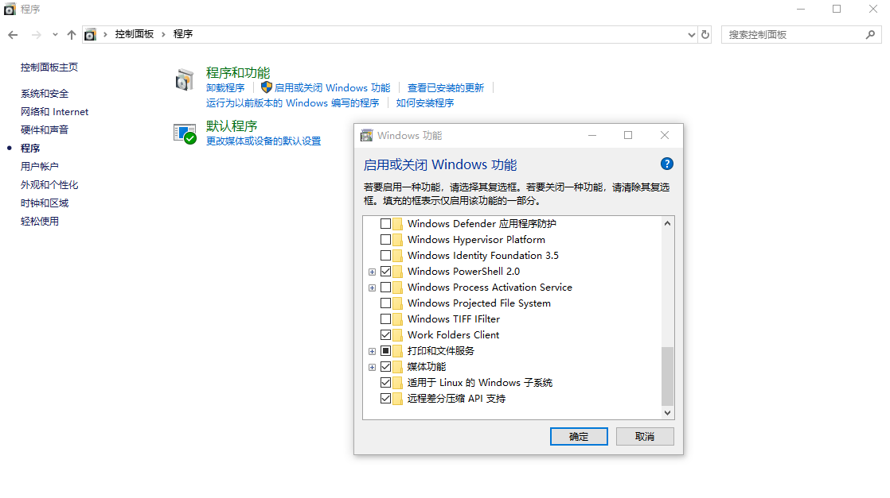
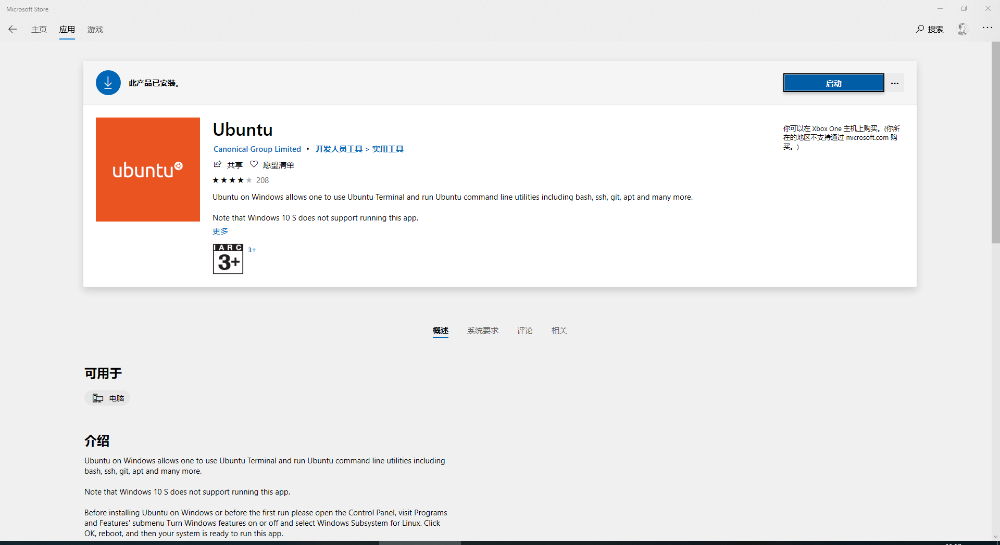
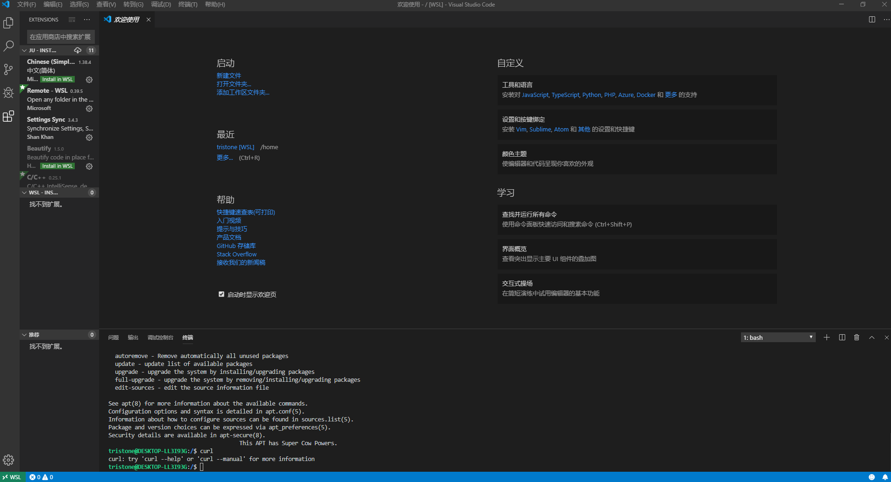

Windows Subsystem for Linux（简称WSL）是一个在Windows 10上能够运行原生Linux二进制可执行文件（ELF格式）的兼容层。它是由[微软](https://baike.baidu.com/item/微软/124767)与Canonical公司合作开发，其目标是使纯正的Ubuntu 14.04 "Trusty Tahr"映像能下载和解压到用户的本地计算机，并且映像内的工具和实用工具能在此子系统上原生运行。

WSL 2是微软在2019年5月7日的微软Build大会上发布的基于Windows的Linux子系统。可以通过`控制面板→程序→程序和功能→启用或关闭Windows功能→适用于Linux的Windows子系统`来打开或者关闭。

打开后在微软应用商店搜索Ubuntu进行安装即可。

WSL依赖于Windows 10 1709及以上版本系统。

WSL不提供关于Ubuntu的图形界面，但是可以通过VS Code的插件`Remote-WSL`来远程连接WSL并访问其文件系统。

从当前使用体验来看，一个Windows系统暂时只支持启动一个Linux内核（可以打开多个terminal），这点和虚拟机还是有一些区别的。

WSL 2是基于微软自家的Hyper-V的虚拟化技术的，这也就意味着它不能和VMware等并行运行。