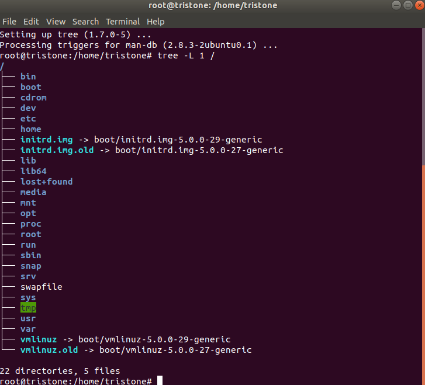
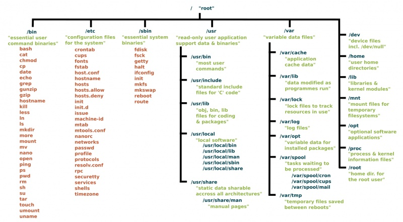

首先安装文件目录查看工具tree：

```bash
sudo apt-get install tree
```

完成后在终端中输入

```
tree -L 1 /
```

即可列出所有一级目录如下图所示：



从以上输出结果可以看出，Linux共包含22个文件夹，其中：

- lost+found文件夹是用来备份的文件夹；
- lib64文件夹是lib文件夹的64位版本；
- snap文件夹是Ubuntu下用来安装软件的文件夹；
- cdrom是光驱文件夹。

剩下的文件夹功能如下所示。

# */bin*

bin是单词binary的简称。这个目录是包含了一些**二进制文件**，即一些可以运行的应用程序。 比如 `ls` 程序，以及新建和删除文件和目录、移动它们程序。还有其它一些程序，等等。**文件系统树的其他部分有更多的*bin*目录**，但我们将在一会儿讨论这些目录。

# */boot*

**`/boot`目录包含启动系统所需的文件。**如果弄乱了其中一个文件，便可能无法运行。同时也不要过度担心会无意中损坏系统，因为必须拥有**root**权限才可以执行这个操作。

# */dev*

dev是device的简称。`/dev`目录包含设备文件。其中许多是在启动时或甚至在运行时生成的。 例如，如果你将新的网络摄像头或 USB 随身碟连接到你的机器中，则会自动弹出一个新的设备条目。

# */etc*

`/etc`的字面意思是“etcetera”（诸如此类）。`/etc`得名于最早的Unix系统们，因为它是系统文件管理员不确定在哪里放置的文件的垃圾场。

现在，说`/etc`是*要配置的所有内容(Everything To Configure)*更为恰当，**因为它包含大部分的系统配置文件**。 例如，包含系统名称、用户及其密码、网络上计算机名称以及硬盘上分区的安装位置和时间的文件都在这里。

# */home*

`/home`是你可以找到用户个人目录的地方。当以此用户身份登录时，比如tristone用户，那么输入

```bash
cd ~
```

则会进入到目录`home/tristone`中，这个目录代表用户tristone的家目录。如果我们在目录`home`下执行

```bash
mkdir anotherUser
```

则会报错，提示我们没有权限，这是因为目录`home`是所有用户所共享的，我们不能在这个目录下对其他用户目录进行添加或者更改。

# */lib*

`/lib`是库文件所在的地方。库包含应用程序可以使用的代码文件。它们包含桌面绘制窗口、控制外围设备或将文件发送到硬盘的代码片段。

除此之外，它包含了所有重要的内核模块。 内核模块是使你的显卡、声卡、WiFi、打印机等工作的驱动程序。

# */media*

在`/media`目录中，当你插入外部存储器试图访问它时，将自动挂载它。

# */mnt*

然而，`/mnt`目录是一些过去的残余。这是你手动挂载存储设备或分区的地方。现在不常用了。

# */opt*

`/opt`目录通常是你编译软件（即，你从源代码构建，并不是从你的系统的软件库中安装软件）的地方。应用程序最终会出现在 `/opt/bin` 目录，库会在`/opt/lib` 目录中出现。

# */proc*

`/proc`，就像`/dev`是一个虚拟目录。它包含有关你的计算机的信息，例如关于你的CPU和你的Linux系统正在运行的内核的信息。与`/dev`一样，文件和目录是在计算机启动或运行时生成的，因为你的系统正在运行且会发生变化。

# */root*

`/root`是用户root的主目录。 与其他用户主目录是分开的，**因为你不应该动它**。 所以把自己的东西放在你自己的目录中，伙计们。当我们以root用户的身份执行一下命令：

```bash
cd ~
```

那么我们就会进入到这个`root`目录中，因为这个目录是用户root的家目录。

# */run*

`/run`是另一个新出现的目录。系统进程出于自己不可告人的原因使用它来存储**临时数据**。这是另一个**不要动它**的文件夹。

# */sbin*

`/sbin`与`/bin`类似，但它包含的应用程序只有root才需要。也可以使用`sudo`命令使用这些应用程序。`/sbin`目录通常包含可以**安装、删除和格式化**各种东西的工具。你可以想象，如果你使用不当，这些指令中有一些是致命的，所以要小心处理。

# */usr*

`/usr`目录是在UNIX早期用户的主目录所处的地方。如今，`/usr`包含了大量目录，而这些目录又包含了应用程序、库、文档、壁纸、图标和许多其他需要应用程序和服务共享的内容。

许多现代的 Linux 发行版只是把所有的东西都放到 `/usr/bin` 中，并让 `/bin` 指向 `/usr/bin`，以防彻底删除它会破坏某些东西。因此，Debian、Ubuntu和Mint仍然保持`/bin`和`/usr/bin`（和`/sbin`和`/usr/sbin`）分离；其而比如Arch和它衍生版，只是有一个真实存储二进制程序的目录，`/usr/bin`，其余的任何 `bin` 目录是指向 `/usr/bin`的假目录。

# */srv*

**svr是server的简写**。`/srv`目录包含服务器的数据。如果你正在Linux机器上运行Web服务器，你网站的HTML文件将放到 `/srv/http`（或`/srv/www`）。如果你正在运行FTP服务器，则你的文件将放到`/srv/ftp`。

# */sys*

`/sys`是另一个类似`/proc`和`/dev`的虚拟目录，它还包含连接到计算机的设备的信息。

# */tmp*

**tmp是temporary的简写**，其包含临时的文件，通常由正在运行的应用程序放置。**`/tmp`是少数挂载到根目录下而你可以在不成为超级用户的情况下与它进行实际交互的目录之一。**

# */var*

`/var`最初被如此命名是因为它的内容被认为是*可变的(variable)*，因为它经常变化。

许多目录的子目录的功能如下图所示：



# 参考文献

- [The Linux Filesystem Explained](https://www.linux.com/tutorials/linux-filesystem-explained/);
- [Linux FIlesystem Ach](https://zhuanlan.zhihu.com/p/38802277).

