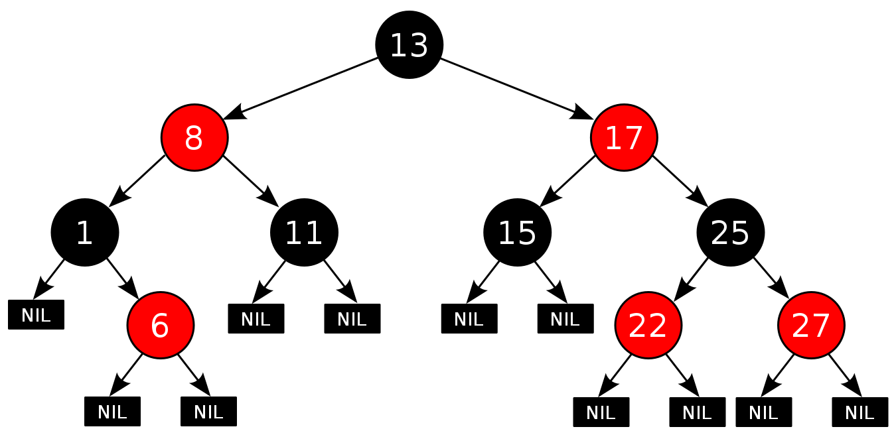

# 定义

红黑树是一种平衡二叉查找树。这意味着红黑树**既有着平衡的性质，也有着能够查找（搜索）的性质**。

红黑树属于平衡二叉树，**但它不是严格平衡的。** 严格的平衡二叉树要求左右子树的高度差为1，而红黑树不是。所以从严格性上来排序的话，能够得到以下顺序：**二叉查找树<红黑树<平衡二叉查找树。**

# 性质

红黑树是**每个节点都带有颜色属性的二叉查找树**，颜色为红色或黑色。在二叉查找树强制一般要求以外，对于任何有效的红黑树我们增加了如下的额外要求：

1. 节点是红色或黑色。
2. 根是黑色。
3. 所有叶子都是黑色（叶子是`NIL`节点）。
4. 每个红色节点必须有两个黑色的子节点。（从每个叶子到根的所有路径上不能有两个连续的红色节点）。
5. 从任一节点到其每个叶子的所有简单路径都包含相同数目的黑色节点。(具有相同的黑高)。

以下即为一棵红黑树：

## 对于性质的分析

这些约束确保了红黑树的关键特性：**从根到叶子的最长的可能路径不多于最短的可能路径的两倍长**。结果是这个树大致上是**平衡**的。

操作比如插入、删除和查找某个值的最坏情况时间都要求与树的高度成比例，这个在高度上的理论上限允许红黑树在**最坏情况下都是高效**的，而不同于普通的二叉查找树。 

### 红黑树的高效性保持

根据`性质5`，我们可以得到任意两条路径的黑高相同，即他们的黑色节点数相同。根据`性质4`，因为任意一条路径的红色节点出现必须与黑色节点交叉出现，而黑色节点可以单独出现，我们可以得到任意一条路径的红色节点数目小于黑色节点的数目。因此，**任意两条路径之间的差距不可能大于一倍。**

