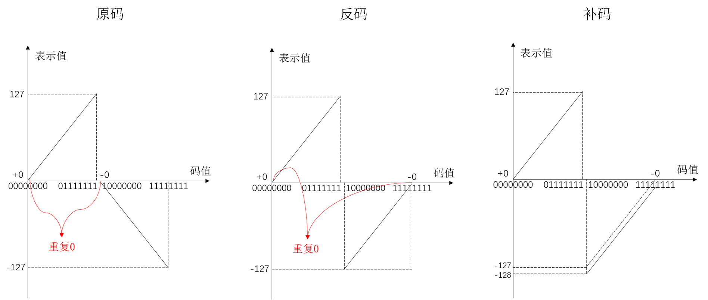
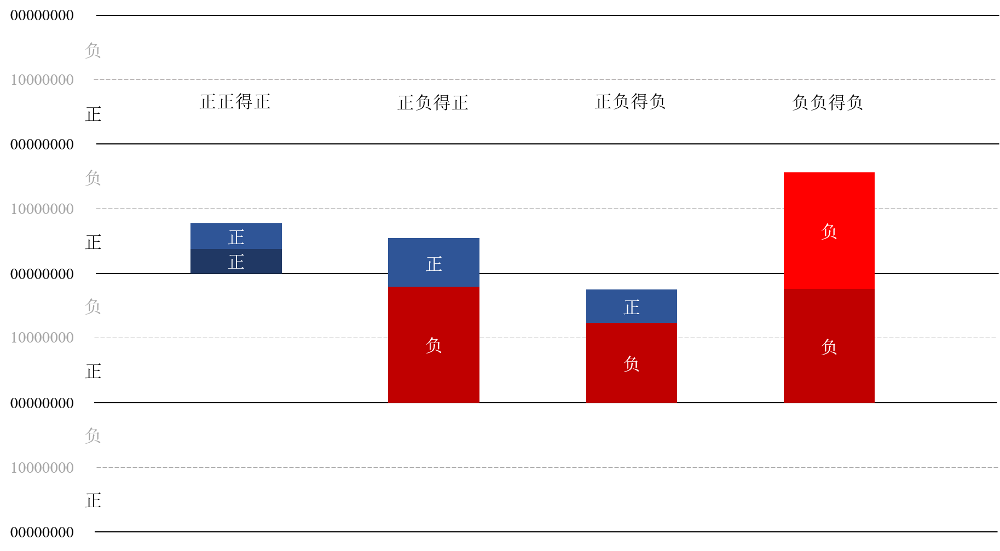

# 原码

## 原码规则

把左边第一位腾出位置，用来存放符号。正号用0来表示，负号用1来表示。这种表示**对人类友好，但是对于计算机不友好**。其有以下几个缺点：

- 可以进行表示，但是**无法进行运算**。两个用原码表示的数字用自然规则进行运算，得到的结果不一定是正确的；
- 存在两个0，即正0与负0，这是一种对于编码的浪费。

# 反码

## 反码规则

反码对于正数的表示规则相对于原码没有改变，但是负数上进行了改变，即符号位仍然是1，但是其余各位取反。

`反码的出现解决了正负相加等于0的问题：每一对正负数相加正好等于全1，在反码的表示规则中，全1表示负0。`

但是存在两个0的问题仍然没有得到解决。

# 补码

## 补码规则

补码的表示**对人类不友好，但是对于计算机友好**。我们希望只有一个0，所以发明了"补码"。"补码"的意思是，从原来"反码"的基础上，补充一个新的代码（+1），这样便完美地消除掉了负0，并且也空出了一个编码用来表示一个新的数字。

# 三种编码的比较

三种编码的区别如下图所示。

$\mathbf{X}$是表示值，$[\mathbf{X}]_{原}, [\mathbf{X}]_{反}, [\mathbf{X}]_{补}$代表三种不同的码值。三种编码的数学表示如下：

- 原码的数学表示为：
  $$
  [\mathbf{X}]_{原}=\left\{\begin{array}{cc}{\mathbf{X}} & {2^{\mathbf{n}-1}>\mathbf{X} \geq 0} \\ {2^{\mathbf{n}-1} -\mathbf{X}} & {0 \geq \mathbf{X} >-2^{\mathbf{n}-1}}\end{array}\right.
  $$

- 反码的数学表示为：
  $$
  [\mathbf{X}]_{反}=\left\{\begin{array}{ll}{\mathbf{X}} & {2^{\mathbf{n}-1}>\mathbf{X} \geq 0} \\ {\left(2^{\mathbf{n}}-1\right)+\mathbf{X}} & {0 \geq \mathbf{X}>-2^{\mathbf{n}-1}}\end{array}\right.
  $$

- 补码的数学表示为：
  $$
  [\mathbf{X}]_{补}=\left\{\begin{array}{ll}{\mathbf{X}} & {2^{\mathbf{n}-1}>\mathbf{X} \geq 0} \\ {2^{\mathbf{n}}+\mathbf{X}} & {0>\mathbf{X} \geq -2^{\mathbf{n}-1}}\end{array}\right.
  $$

这里对三种编码的运算做一个比较：这种比较是基于四则运算的，且比较的`前置条件`是**两个运算数的表示值的理论上的运算结果应当位于编码的表示区间内**。下面的以上图中**八个二进制位**为例来进行阐释。

## 负数转换性质

我们首先定义如何得到一个**码的表示值的负数的码**，**即不论一个码是正码还是负码，皆各位取反后加一，将此码定义为其负数的码**。暂且称此性质为**负数转换性质**。

事实上，只有补码按照该规则取到的码才为正确的该数负数的码，其他（原码、反码）按照此方式皆为错误的码。

### 原码负数转换性质错误性证明

当$\mathbf{X}$为正数时，其码仍为$\mathbf{X}$，取反后为$2^{\mathbf{n}}-1-\mathbf{X}$，加一后得$2^{\mathbf{n}}-\mathbf{X}$。而$-\mathbf{X}$的码为$2^{\mathbf{n}-1}+\mathbf{X}$，两者不相等；

当$\mathbf{X}$为负数时，其码为$2^{\mathbf{n}-1}-\mathbf{X}$，取反后为$2^{\mathbf{n}}-1-(2^{\mathbf{n}-1}-\mathbf{X})$，加一后得$2^{\mathbf{n}}-(2^{\mathbf{n}-1}-\mathbf{X})$，即$2^{\mathbf{n}-1}+\mathbf{X}$，而$-\mathbf{X}$的码为$-\mathbf{X}$，两者不相等；

综上，**负数转换性质**在原码**不成立**；

### 反码负数转换性质错误性证明

当$\mathbf{X}$为正数时，其码仍为$\mathbf{X}$，取反后为$2^{\mathbf{n}}-1-\mathbf{X}$，加一后得$2^{\mathbf{n}}-\mathbf{X}$。而$-\mathbf{X}$的码为$\left(2^{\mathbf{n}}-1\right)-\mathbf{X}$，两者差一，不相等；

当$\mathbf{X}$为负数时，其码为$\left(2^{\mathbf{n}}-1\right)+\mathbf{X}$，取反后为$2^{\mathbf{n}}-1-(\left(2^{\mathbf{n}}-1\right)+\mathbf{X})$，加一后得$2^{\mathbf{n}}-(\left(2^{\mathbf{n}}-1\right)+\mathbf{X})$，即$1-\mathbf{X}$，而$-\mathbf{X}$的码为$- \mathbf{X}$，两者差一，不相等；

综上，**负数转换性质**在反码**不成立**；

### 补码负数转换性质正确性证明

当$\mathbf{X}$为正数时，其码仍为$\mathbf{X}$，取反后为$2^{\mathbf{n}}-1-\mathbf{X}$，加一后得$2^{\mathbf{n}}-\mathbf{X}$。而$-\mathbf{X}$的码为$2^{\mathbf{n}}-\mathbf{X}$，两者相等；

当$\mathbf{X}$为负数时，其码为$2^{\mathbf{n}} + \mathbf{X}$，取反后为$2^{\mathbf{n}}-1-(2^{\mathbf{n}}+\mathbf{X})$，加一后得$2^{\mathbf{n}}-(2^{\mathbf{n}}+\mathbf{X})$，即$ - \mathbf{X}$，而$-\mathbf{X}$的码为$ -\mathbf{X}$，两者相等；

综上，**负数转换性质**在反码**成立**；

## 码的加法规则

从末位开始相加，依次向前进位，若最高位有进位则简单地将其丢弃。

## 码的减法规则

按照**减去一个数=加上这个数的负数**原则，码的减法规则可以简化为码的加法规则+负数转换性质。

## 如何证明补码的运算时正确的

由于补码满足**负数转换性质**，所以我们只需要证明**码的加法规则**在补码处适用即可，即**两个码的码值相加所得到的码值所对应的表示值即为它们表示值相加的和**。

## 正数相加

为了保证满足以上前置条件，正数相加的范围是**理论结果值不大于127**。设符号$c$为码值，$$r$$为表示值。

### 原码（成立）

从图中可以看出，由于码值与表示值在正数范围内呈线性关系，即$r=\alpha \times c$ ，其中$\alpha$为系数，值为1。设$r_{1}=\alpha \times c_{1}$，$r_{2}=\alpha \times c_{2}$，则容易得到：
$$
r_{1}+r_{2}=\alpha \times c_{1}+\alpha \times c_{2}=\alpha \times(c_{1}+c_{2})
$$
该式表明，两个编码值相加后的结果的表示值仍然**正确**。

### 反码（成立）

**反码**：反码的正数部分与原码相同，故**同上**。

### 补码（成立）

**补码**：补码的正数部分与原码相同，故**同上**。

## 正负相加

### 原码（不成立）

假设$r_{1}$为正，其码$c_{1} = r_{1}$；$r_{2}$为负，按照原码的规则，其码$c_{2}=2^{n-1}-r_{2}$。

两个码相加的码值为$c_{1}+c_{2}=r_{1}+2^{n-1}-r_{2}$。两个码的表示值的和为$r_{1} + r_{2}$。其对应两种形况：

- $r_{1} + r_{2}$为正数：那么其对应的码值为$r_{1} + r_{2}$，与$r_{1}+2^{n-1}-r_{2}$**不相等**；
- $r_{1} + r_{2}$为负数：那么其对应的码值为$2^{n-1}-(r_{1}+r_{2})$，与$r_{1}+2^{n-1}-r_{2}$**不相等**。

### 反码（部分成立）

假设$r_{1}$为正，其码$c_{1} = r_{1}$；$r_{2}$为负，按照反码的规则，其码$c_{2}=2^{n}-1+r_{2}$。

两个码相加的码值为$c_{1}+c_{2}=r_{1}+2^{n}-1+r_{2}$。两个码的表示值的和为$r_{1} + r_{2}$。其对应两种形况：

- $r_{1} + r_{2}$为正数：那么其对应的码值为$r_{1} + r_{2}$，与$r_{1}+2^{n}-1+r_{2}$**不相等**；
- $r_{1} + r_{2}$为负数：那么其对应的码值为$2^{n}-1+(r_{1}+r_{2})$，与$$r_{1}+2^{n}-1+r_{2}$$**相等**。

### 补码（成立）

假设$r_{1}$为正，其码$c_{1} = r_{1}$；$r_{2}$为负，按照补码的规则，其码$c_{2}=2^{n} + r_{2}$。

两个码相加的码值为$c_{1}+c_{2}=r_{1}+2^{n} + r_{2}$。两个码的表示值的和为$r_{1} + r_{2}$。其对应两种形况：

- $r_{1} + r_{2}$为正数：那么其对应的码值为$$r_{1}+ r_{2}$$，与$r_{1}+2^{n}+r_{2}$看似不相等，其实后者的$2^{n}$会以进位的方式丢弃，实际上**相等**；
- $r_{1} + r_{2}$为负数：那么其对应的码值为$2^{n}+(r_{1}+r_{2})$，与$$r_{1}+2^{n} +r_{2}$$**相等**。

## 负负相加

为了保证满足以上前置条件，负数相加的范围是**理论结果值大于-127（补码可以等于）**。设符号$c$为码值，$$r$$为表示值。

### 原码（不成立）

两个表示值相加后的表示值为$r_{1}+r_{2}$。

两个表示值对应的码值为$c_{1}=2^{n-1}-r_{1}$, $c_{2}=2^{n-1}-r_{2}$，它们的和为$c_{1}+c_{2}=2^{n}-(r_{1}+r_{2})$。

而表示值$r_{1}+r_{2}$的码值为$2^{n-1}-(r_{1}+r_{2})$。

两者**不相等**。

### 反码（不成立）

两个表示值相加后的表示值为$r_{1}+r_{2}$。

两个表示值对应的码值为$c_{1}=2^{n}-1+r_{1}$, $c_{2}=2^{n}-1+r_{2}$，它们的和为$c_{1}+c_{2}=2^{n+1}+(r_{1}+r_{2})-2$。

而表示值$r_{1}+r_{2}$的码值为$2^{n}- 1 + (r_{1}+r_{2})$。

两者**不相等**。

### 补码（成立）

两个表示值相加后的表示值为$r_{1}+r_{2}$。

两个表示值对应的码值为$c_{1}=2^{n}+r_{1}$, $c_{2}=2^{n} +r_{2}$，它们的和为$c_{1}+c_{2}=2^{n+1}+(r_{1}+r_{2})$。

而表示值$r_{1}+r_{2}$的码值为$2^{n} + (r_{1}+r_{2})$。

由于进位会被省略，故两者**相等**。

## 为什么不讨论相减的情况

因为所有相减的情况都可以通过负数变换得到以上四种情况之一，故没有必要探讨相减的情况。

## 关于为什么加法运算在补码成立的直观理解

下面这张图可以直观地解释为什么补码的加法是正确的：

