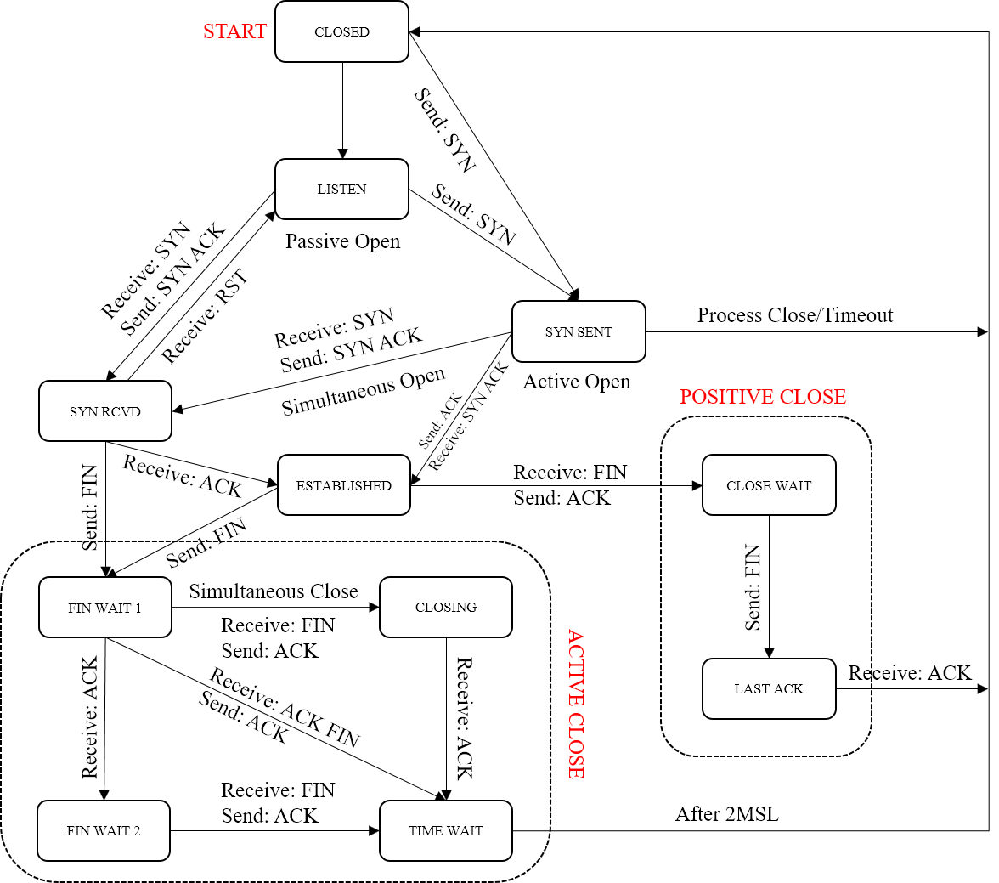

TCP是基于Internet Protocal的协议，位于运输层，在TCP中通信双方实体是**对等**的。

# 自动状态机模型

在该模型中，共存在11个状态，任意时刻任意一方都处于这11个状态之中。这些状态中包括：

- CLOSED状态：初始状态。处于该状态时：
  - 当当前实体需要主动通信时，打开并发送SYN到SYN SENT状态.
  - 当当前实体需要被动通信时，打开到LISTEN状态。
- LISTEN状态：监听状态。处于该状态时：
  - 若想主动通信，发送SYN到SYN SENT状态。
  - 若被动收到了SYN，发送SYN ACK到SYN RCVD状态。
- SYN SENT状态：已发送连接请求状态。处于该状态时：
  - 若应用进程关闭该请求，或该请求未收到响应（超时），进入CLOSED状态。
  - 若收到了SYN请求，说明**同时打开**，发送SYN及ACK到SYN RCVD状态。
  - 若收到了SYN ACK，发送ACK到ESTABLISHED状态。
- SYN RCVD状态：已收到连接请求状态。处于该状态时：
  - 若收到了ACK，进入ESTABLISHED状态。
  - 若发送FIN，说明连接未建立即终止，进入FIN WAIT 1状态（主动关闭）。
  - 若收到了RST，重置并进入LISTEN状态。
- ESTABLISHED状态：连接已建立状态。处于该状态时：
  - 若发送FIN，说明为主动关闭连接，进入FIN WAIT 1状态。 
  - 若收到FIN，说明为被动关闭连接，发送ACK并进入CLOSE WAIT状态。
- FIN WAIT 1状态：已发送关闭请求状态。处于该状态时：
  - 若收到ACK，说明关闭请求已被响应，进入FIN WAIT 2状态。
  - 若收到FIN，说明**同时关闭**，发送ACK并进入CLOSING状态。
  - 若收到FIN ACK，说明关闭请求被响应且请求关闭，发送ACK进入TIME WAIT状态。
- FIN WAIT 2状态：已收到关闭响应状态，处于该状态时：
  - 若收到FIN，说明请求关闭，发送ACK并进入TIME WAIT状态。
- CLOSING 状态：剩余我方请求未响应状态。处于该状态时：
  - 若收到ACK，说明关闭请求已被响应，进入TIME WAIT状态。
- TIME WAIT状态：2MSL状态，处于该状态时：
  - 若超过2MSL未收到请求，说明ACK安全送达，自动进入CLOSED状态。
- CLOSE WAIT状态：被动关闭状态。处于该状态时：
  - 若发送FIN，则说明我方请求仍未响应，进入LAST ACK状态。
- LAST ACK状态：等待关闭响应状态。处于该状态时：
  - 若收到ACK，说明关闭请求已响应，进入CLOSED状态。

该自动机转化模型如下所示：

# FAQs

## TCP和UDP可以共同占用一个端口号吗?

首先来看ipv4的ip包头格式：

里面包含了Protocol字段，说明在网络层便可以将传输层进行区分，从而将包交付给不同的协议守护进程。

由此可见，**TCP/UDP可以使用相同的端口号，因为它们的报文在网络层向上交付时便已经做了区分。**

## 为什么一个80端口可以建立很多连接?

 一个**连接**的唯一标识是：
$$
[server ip, server port, client ip, client port]
$$
也就是说，操作系统，接收到一个**端口**发来的数据时，会在该端口，产生的**连接**中，查找到符合这个唯一标识的并传递信息到对应缓冲区。 

-  一个端口同一时间只能bind给一个socket。就是同一时间一个端口只可能有一个监听线程（监听listen之前要bind）；
- 为什么一个端口能建立多个TCP连接，同一个端口也就是说$serverip$和$server port$是不变的。那么只要$[clientip, clientport]$不相同就可以了。能保证连接唯一标识$[server ip, server port, client ip, client port]$的唯一性。