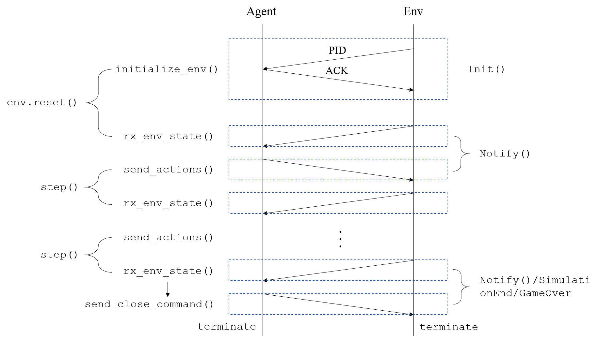

NS3Gym的工作流程主要涉及到两个端，六个类。接下来主要根据这些来分别进行讨论。

# Agent端（Python端）

Agent端的主要代码文件位于src/opengym/model/ns3gym/ns3gym目录下面，其中ns3env.py是主要代码文件，start_sim.py是用来自动启动环境段脚本的文件，可以不关注。agent端主要的两个类的主要的定义都在ns3env.py文件里。分别是`Ns3ZmqBridge`类和`Ns3Env`类（继承了`gym.Env`）。

## Ns3Env

这个类模拟的不是真正的环境端，而是作为我们与真实的环境端（C++端）通信的代理。这个类在初始化时会进行：

```
recv -> send -> recv
```

的操作。前两次是接受环境端的信息（进程以及waf进程的id）并发送确认信息，后一次是接受来自于环境的**初始状态**。**与初始化操作执行相同流程的函数有`reset`函数**。

除此之外，这个类当中的`step`函数是面向于用户的一个接口，模拟了真实的gym库中的step函数，这个函数的通信流程为：

```
send -> recv
```

第一个send用来发送基于上一状态所决策的动作信息，第二个recv用来接受环境端所返回的下一个状态，这个函数的流程可以与初始化函数以及reset函数无缝地衔接在一起，构成：

```
recv -> send -> recv -> send -> recv -> ...
```

的通信链，从而很好地模拟了马尔可夫决策过程。

另一个值得一提的函数是`close`函数，这个函数发送一个结束信息`stopSim`来使得环境端结束模拟并关闭。

## Ns3ZmqBridge

顾名思义，这个类的主要作用是和环境端进行通信，其实例作为一个Ns3Env实例的成员变量，从而构成关联关系。这个类中的主要函数有：

### initialize_env

这个函数的通信流程为：

```
recv -> send
```

首先接受环境端的进程id信息，然后发送一个ACK。

### rx_env_state

接受当前状态，这个函数的通信流程为：

```
[recv] -> [send]
```

其通信流程有三种可能：

- 不接受，也不发送。这种情况是因为新的状态还没有被读取，所以不用再接受信息了；

- 接受，不发送。这种情况是**正常情况**，这个函数本身仅仅负责接收状态就好了；

- 接收，发送。这种情况发生在**接收到关闭请求时**，同时发送关闭请求。其中关闭请求有两种情况：

  - SimulationEnd：也就是环境端返回的模拟结束（环境端需要调用`NotifySimulationEnd`函数），表示**整个学习流程结束**。这种情况关闭agent进程；
  - 其他原因：这种情况返回的是游戏结束（环境端`GetGameOver`函数返回了True），表示**当前episode结束**。这种情况保留agent进程。

  这两种情况对应的代码如下：

  ```python
  if self.gameOver:
      if self.gameOverReason == pb.EnvStateMsg.SimulationEnd:
          self.envStopped = True
          self.send_close_command()
          sys.exit()
      else:
          self.forceEnvStop = True
          self.send_close_command()
  ```

  `self.envStopped`变量表示当前环境进程已经结束，用来防止调用`env.close()`函数时**再次发送关闭请求**。

  `self.forceEnvStop`变量表示强制环境端结束，用来保证在执行`send_actions()`函数时把环境结束的请求带过去。

# Env端（C++端）

这个端的文件主要位于src/opengym/model目录下面，主要包含的类有两个，即`OpenGymInterface`与`OpenGymEnv`类，其中最主要的是`OpenGymInterface`类，同样，后者把前者作为成员变量，两者构成关联关系。

## OpenGymEnv

这个类主要提供给用户进行继承并定义自己的环境。其中包含了主要的七个纯虚函数：

```c++
  virtual Ptr<OpenGymSpace> GetActionSpace() = 0;
  virtual Ptr<OpenGymSpace> GetObservationSpace() = 0;
  virtual bool GetGameOver() = 0;
  virtual Ptr<OpenGymDataContainer> GetObservation() = 0;
  virtual float GetReward() = 0;
  virtual std::string GetExtraInfo() = 0;
  virtual bool ExecuteActions(Ptr<OpenGymDataContainer> action) = 0;
```

基于此类的子类需要实现这些纯虚函数，以使得环境能够得到这些信息从而移交给agent端。

除此之外，这个类中还有一个成员函数：

```c++
void SetOpenGymInterface(Ptr<OpenGymInterface> openGymInterface);
```

这个函数用来设置自己的通信接口实例，并将上面的七个接口函数设置为回调函数，在必要时进行调用。

另外两个函数：

```c++
void Notify();
void NotifySimulationEnd();
```

只是对于`OpenGymInterface`中相同名字函数的封装，无需赘述。

## OpenGymInterface

这个类提供了一个通信的接口，用来与agent端进行通信。主要函数有：

### Init

与`Ns3ZmqBridge`中的`initialize_env`函数类似，这个函数执行的是环境端的初始化，这个函数的通信流程为：

```
send -> recv
```

正好与`initialize_env`相反。这个函数将当前的一些进程信息发送给agent端，并接受agent端的确认信息。

### NotifyCurrentState

这个函数是核心函数，不管是此类中的`Notify`、`NotifySimulationEnd`、`WaitForStop`函数还是`OpenGymEnv`类中的`Notify`、`NotifySimulationEnd`函数都使用这个函数进行通信。

这个函数的执行流程对应于agent端的step函数，这个函数的通信流程也与之相同：

```
send -> recv
```

前者发送状态信息，后者接受新的动作。

### NotifySimulationEnd/WaitForStop

这两个函数用来通知模拟的结束，其会设置一个核心变量`m_simEnd`，然后将结束请求发送到agent端，从而结束模拟过程。

# 工作流程图

工作流程分成两个类型，第一种类型是由agent端关闭（主动关闭），另一种类型是由env端关闭（被动关闭）。

## Agent关闭（主动关闭）


## Env关闭（被动关闭）

