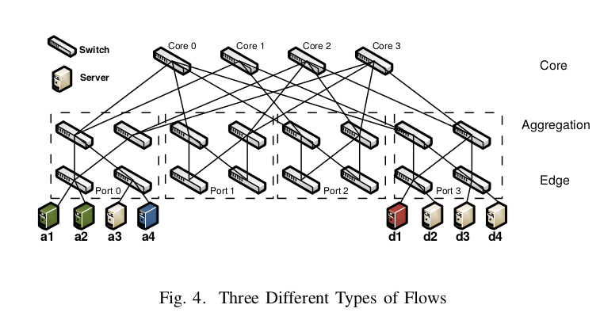

# 前置概念

## POMDP(Partially Observable Markov Decision Process)

POMDP全称为Partially Observable Markov Decision Process，即部分可观测的马尔科夫决策过程，相对于MDP，POMDP的状态是部分可观测的，即非确定性的。

## 拥塞矩阵（Traffic Matrix）

拥塞矩阵被设计来描述网络通信的需求，拥塞矩阵是一个$N \times N$的矩阵，$N$代表网络中节点的数量。矩阵中的第$i$行第$j$列表示从主机$i$到主机$j​$的网络流。

拥塞矩阵可以通过SDN控制器进行测量，但是我们无法提前得知拥塞矩阵。

# 主要思想

使用强化学习学习先前经验，将该强化学习算法集成于SDN centralized Controller中，统一进行学习。

## Agent

代理人就是控制器本身。

## Environment

网络即是环境。

## State

使用前$k(k=10)$个时间的拥塞矩阵作为当前网络的状态，其为一个$K\times N \times N$的矩阵。$N \times N$表示从主机$i$到主机$j$的交通流，$K$代表第前$k$个时间节点。

## Action

是一个二维的矩阵，$A[i][j]$代表从第$i$个节点到第$j​$个节点的运输流应当经过哪一个核心的交换机。基于网络的拓扑结构，从一个节点到另一个节点的路径只需要决定这一项。

## Reward

奖赏函数为：

$$
r=-\alpha \times max_{p \in P} \frac{\sum f_{1}}{c(p)}-\beta \times \frac{\sum f_{2}}{c(p)}
$$

在该函数中，$\alpha$与$\beta$皆为平衡因子，$p$为路径，$c(p)$为该路径的最大容量，$\sum f_{1}$为该路径上所有流之和。

该函数中的最后一项为惩罚项，$f_{2}​$代表那些超过链路瓶颈的流。

## 学习算法

对于时刻$t$的$Q$函数$Q_{t}$，使用老化算法对该状态动作值函数进行计算，以调整未来的预期回报的权重。

$$
Q_{t}=r_{t}+\lambda \times r_{t+1}+\lambda^{2} \times r_{t+2}+\cdots + \lambda^{T-t} \times r_{T}
$$

其中，T是每一个episode的结束。

使用表演者-评论员算法同时对**决策函数**与**值函数**进行学习。