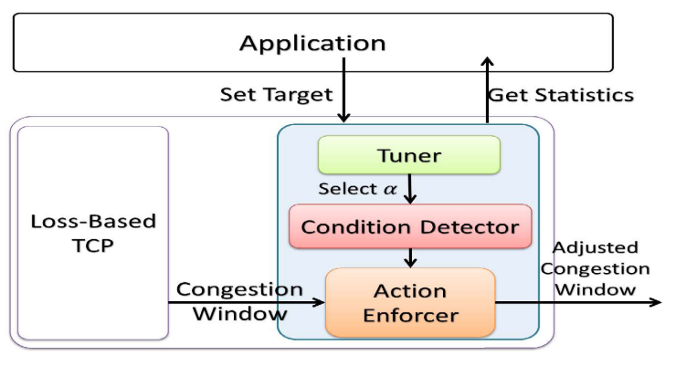

> 这篇论文全称为“C2TCP: A Flexible Cellular TCP to Meet Stringent Delay Requirements”，发表于IEEE JSAC，是一个通信领域的A级会议。

# 摘要

当前的网络协议都是基于吞吐量的，即吞吐量越高越好；但是C2TCP是基于延迟的，旨在应用于对延迟要求更高的环境，这些环境有：

- 虚拟现实；
- 增强现实；
- 实时远程医疗监控；
- 自动驾驶；
- 实时网络游戏；
- 蜂窝网络通信；

C2TCP工作于传统的面向吞吐量的拥塞控制算法。

C2TCP的设计参考了AQM中的CoDel，RED等算法。

# 设计思路

包含了两个部分：

- 一个原生的未更改的基于丢包的TCP；
- 一个窗口调整模块，用来调整第一部分输出的拥塞窗口cwnd。其包含三个部分：
  - Condition Detector: tries to figure out the current condition of the network;
  - Action Enforcer: adjusts the Cwnd of the loss-based TCP;
  - Tuner: uses the statistics gathered by C2TCP such as average packet delay to dynamically tune the Condition Detector.

整体架构如下：

算法使用了硬编码的方案，没有使用机器学习，在细节上没有特别创新的地方，不赘述。

## Condition Detector

包含三个状态：Good, Normal and Bad。

这三个状态主要根据两个变量来决定，它们是：

- 在$t-Interval$到$t$的时间区间内，所测量到的最小的$RTT$；
- 在当前时刻$t$的$RTT$.

有一个参数叫做$Setpoint$。

- 当#1>$Setpoint$时，处于Bad状态；
- 当#1<$Setpoint$ and #2>$Setpoint$时，处于Normal状态；
- 当#1<$Setpoint$ and #2<$Setpoint$时，处于Good状态。

当然，$Setpoint$和$Interval$也会动态调整。$Setpoint$也会根据参数$\alpha$进行计算。

## Action Enforcer

根据得到的状态信息，决定下一步动作。

## Tuner

根据用户给定的目标RTT，通过调整$\alpha$尽量去逼近。

# 启发

## 使用AQM来设计

文中有这样的一句话：

> If we had an in-network AQM algorithm able to detect a bad condition, what would have it done to inform a loss-based TCP and what would be the reaction of the loss-based TCP?

如果在AQM的机制中我们能检测到了一个坏的状态，我们应当做些什么来通知一个基于丢包的TCP算法，并且这个算法应当采取什么样的动作？

**毫无疑问，loss-based和AQM是互相合作，相辅相成的。**

## 增量性

未直接设计一个拥塞控制算法，而是在原算法的基础上进行改进。

