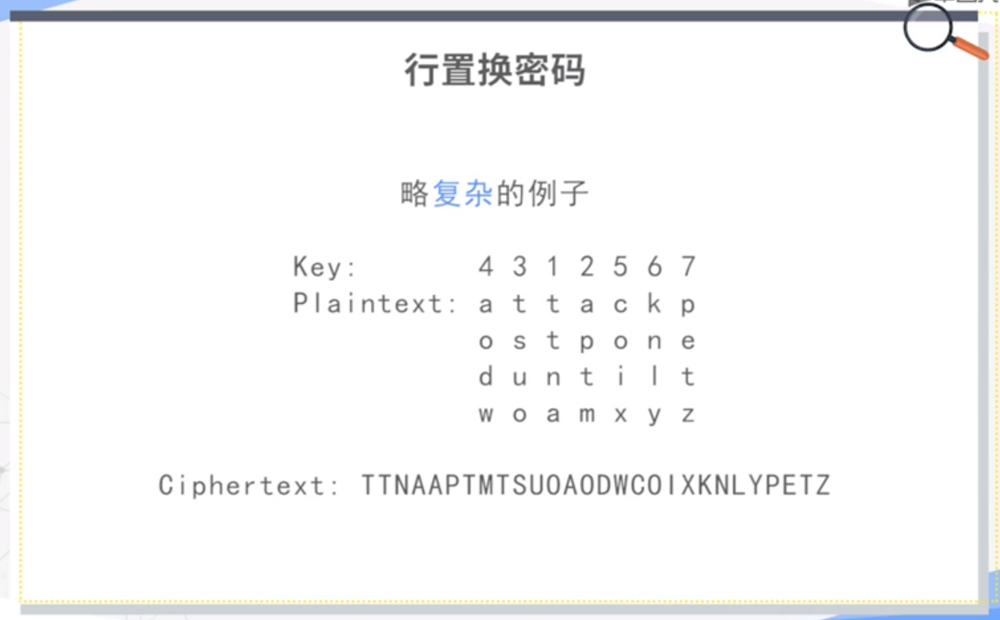
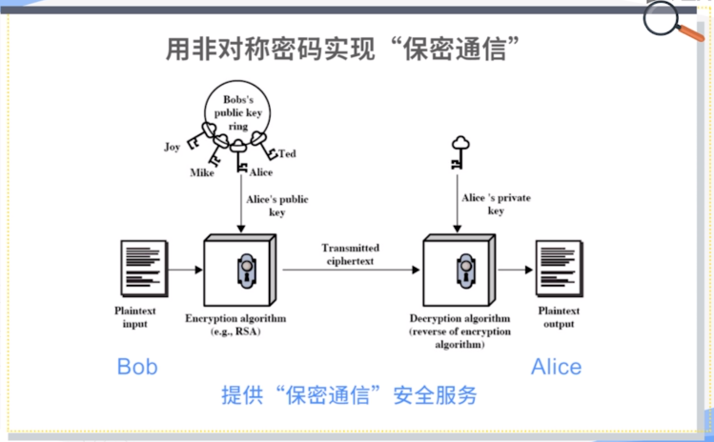

密码研究领域分类：

- 密码编码学（cryptography）：study of encryption principles/methods;
- 密码分析学（cryptanalysis）：the study of principles/methods of deciphering cipher text *without knowing key*;
- 密码学（cryptology）：the field of both cryptography and cryptanalysis.

# 古典密码学

## 对称密钥密码模型

对称密钥密码模型（Symmetric Cipher Model）。

> A cryptosystem is a 5-tuple $ (E,D,M,K,C) $，where
>
> - $M$ is the set of plain texts;
> - $C$ is the set of cipher texts;
> - $K$ is the set of keys;
> - $E:M \times K \rightarrow C$ is the set of encryption algorithms;
> - $D:C \times K \rightarrow M$ is the set of decryption algorithms.

密码需求或者密码服务：保密性、完整性、可用性。

**羊皮传书（置换密码）**：羊皮带子缠绕到木棒上。

**藏头诗（隐写术）**：每一句诗首字母。

**凯撒密码（替代密码）**：对每一个字母进行一个替换。

概念：

- 明文（plain text）：the original message;
- 密文（cipher text）：the coded message;
- 密钥（key）：info used in cipher known only to sender/receiver;
- 加密（算法）（encipher/encrypt）：converting plain text to cipher text;
- 解密（算法）（decipher/decrypt）：recovering plain text from cipher text.

要求：

- 在传输前需要协商好密钥，需要进行带外传输；
- 秘密应该全部寓于密钥（而非加密解密算法）$\neq$ 算法应当全部公开；
- 方便使用。

## 如何设计好的密码算法

定义：

- 无条件安全（unconditional security）：No matter how much computer power is available, the cipher cannot be broken since the ciphertext provides insufficient information to uniquely determine the corresponding plaintext;
- 计算安全（computational security）：Given limmied computing resources, the cipher cannot be broken.

**单字母表密码**（对凯撒密码的改进）：

凯撒密码仅仅使用某一字母后数几个数字的字母作为替代，而单字母表密码打乱了这种顺序。大大增加了密钥的数量。可以通过词频分析来进行解密。

**弗吉尼亚密码**（对凯撒密码的改进，当密钥长度与明文相同时，成为自动生成密钥密码Autokey Cipher）：

存有多个字母表，通过变量$k$指定选择哪一个密码表进行加密。$k$可以通过字母来进行指定，比如dece相当于4535，通过循环使用4535即dece即可完成对明文的加密。

缺陷：密钥的长度容易被分析得到。

**自动生成密钥密码**（对弗吉尼亚密码的改进）：

- 先用初始密钥加密明文；
- 密文由发送者发送给接收方；
- 接收方有同样的密钥，解密得到初始明文；
- 发送者将初始的明文作为密钥，加密后面的明文；
- 接收方将初始解密得到的明文来解密收到的密文

缺陷：密钥出现的统计规律与明文相同。

如何解决这种问题：

- 密钥和明文一样长；
- 密钥应当与明文独立，没有统计规律（使用随机序列）。

## 对称密钥密码的理论标杆

**弗纳姆密码**（一次一密，One-Time Pad，**具有无条件安全性**）：

处理的对象是比特。通过以下算法加密与解密：
$$
C_{i}=P_{i} \oplus K_{i} \\
P_{i}=C_{i} \oplus K_{i}
$$
要求通信双方事先共享一个随机的密钥序列。

## 简单的置换密码

三种密码分类：

- **替代密码**：明文里的一个字符或者一个比特，使用密文里的一个字符或者一个比特进行替代。

- **置换密码**：在密文里对明文进行重新的排列。

- **乘积密码**：两次替代，两次置换，一次置换一次替代，一次替代一次置换等。现代密码几乎都是乘积密码。

**Rail Fence密码**（羊皮传书的一种特例，也是一种置换密码）。

**行置换密码**：

## 转子机

现代密码出现前，转子机是一种典型的乘积密码，是古典密码的高峰（二战时用到）。

通过转子转动来选取字母表，共有三排转子，分别是快速转子、中速转子和慢速转子，每前面的转子转一圈后面的转子转一格。共有$26^3$种状态，每一种状态对应一个字母表。

# 公开密钥密码学

## 对称密钥密码的密钥交换问题

在真正的通信开始前，需要共享密钥$Key$，需要使用安全的信道进行传递，这是一个问题。

## 公开密钥模型提出

每个人有两个密钥：公钥（Public key）和私钥（Private key）。

加密只需要公开密钥，而解密则需要公开密钥和私有密钥。

根据使用的密钥的数量可以分为：

- 对称的、单密钥、秘密密钥、传统密码技术；
- 非对称的、双密钥、公钥密码技术。

