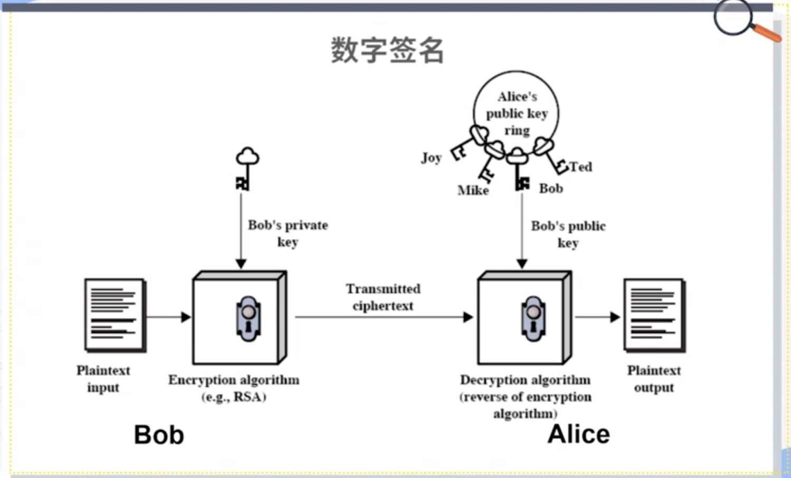
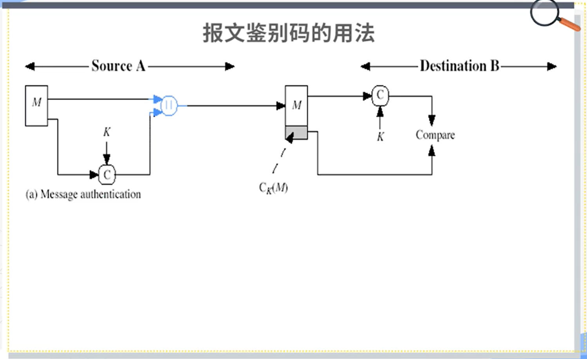
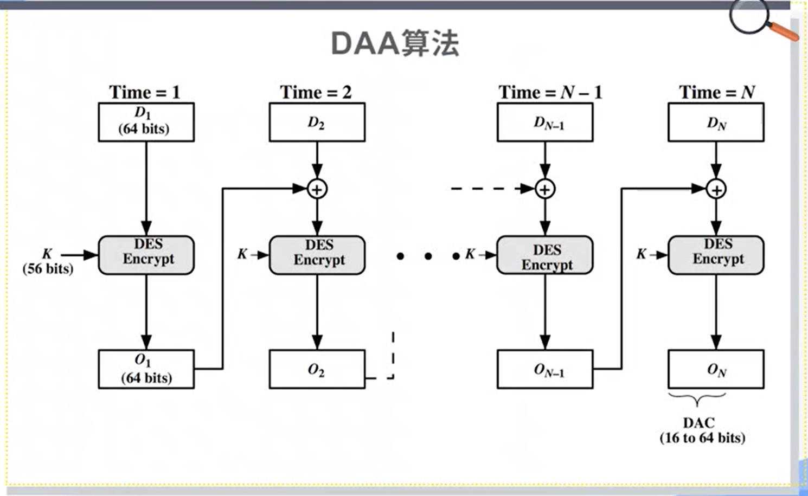
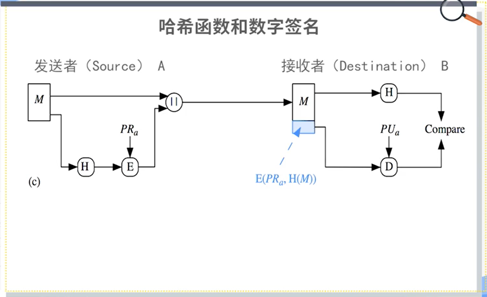
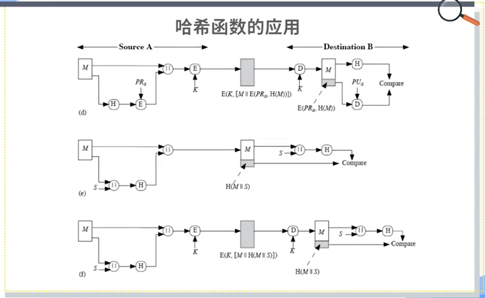
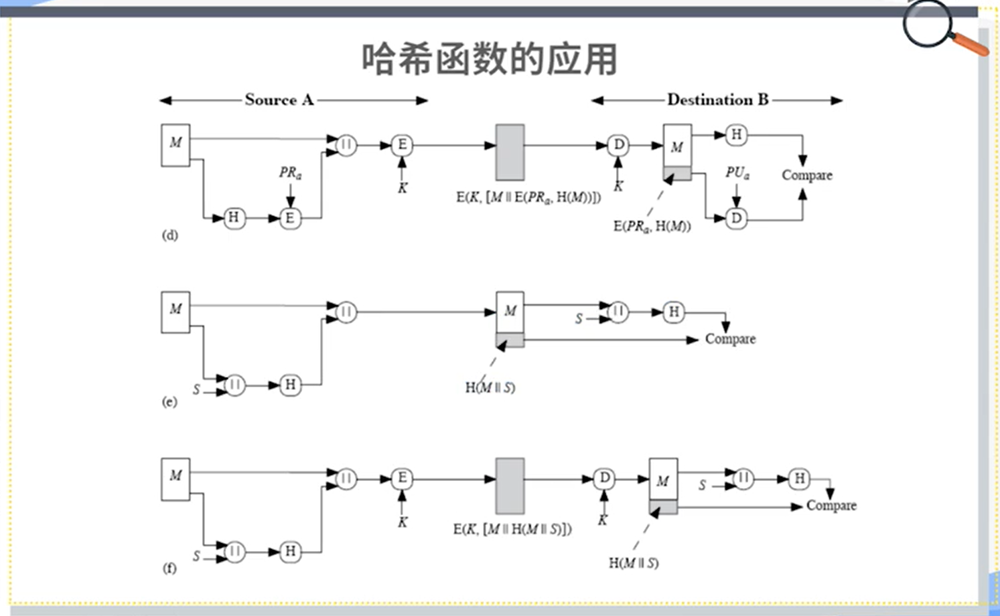
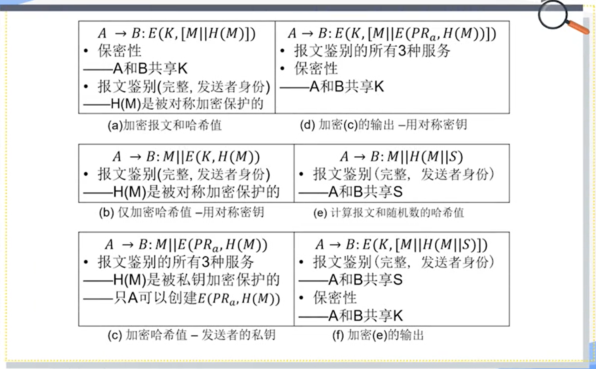
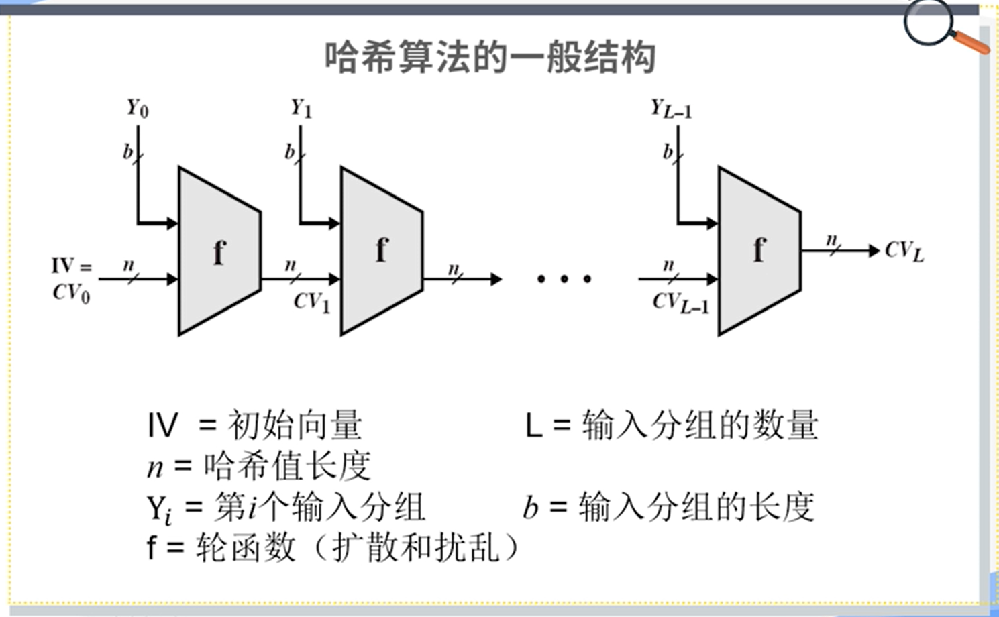

密码研究领域分类：

- 密码编码学（cryptography）：study of encryption principles/methods;
- 密码分析学（cryptanalysis）：the study of principles/methods of deciphering cipher text *without knowing key*;
- 密码学（cryptology）：the field of both cryptography and cryptanalysis.

# 古典密码学

## 对称密钥密码模型

对称密钥密码模型（Symmetric Cipher Model）。

> A cryptosystem is a 5-tuple $ (E,D,M,K,C) $，where
>
> - $M$ is the set of plain texts;
> - $C$ is the set of cipher texts;
> - $K$ is the set of keys;
> - $E:M \times K \rightarrow C$ is the set of encryption algorithms;
> - $D:C \times K \rightarrow M$ is the set of decryption algorithms.

密码需求或者密码服务：保密性（Confidentiality）、完整性（Integrity）、可用性（Availability）、可认证（Authentication）和抗抵赖/抗否认（Non-repudiation）。

**羊皮传书（置换密码）**：羊皮带子缠绕到木棒上。

**藏头诗（隐写术）**：每一句诗首字母。

**凯撒密码（替代密码）**：对每一个字母进行一个替换。

概念：

- 明文（plain text）：the original message;
- 密文（cipher text）：the coded message;
- 密钥（key）：info used in cipher known only to sender/receiver;
- 加密（算法）（encipher/encrypt）：converting plain text to cipher text;
- 解密（算法）（decipher/decrypt）：recovering plain text from cipher text.

要求：

- 在传输前需要协商好密钥，需要进行带外传输；
- 秘密应该全部寓于密钥（而非加密解密算法）$\neq$ 算法应当全部公开；
- 方便使用。

## 如何设计好的密码算法

定义：

- 无条件安全（unconditional security）：No matter how much computer power is available, the cipher cannot be broken since the ciphertext provides insufficient information to uniquely determine the corresponding plaintext;
- 计算安全（computational security）：Given limmied computing resources, the cipher cannot be broken.

**单字母表密码**（对凯撒密码的改进）：

凯撒密码仅仅使用某一字母后数几个数字的字母作为替代，而单字母表密码打乱了这种顺序。大大增加了密钥的数量。可以通过词频分析来进行解密。

**弗吉尼亚密码**（对凯撒密码的改进，当密钥长度与明文相同时，成为自动生成密钥密码Autokey Cipher）：

存有多个字母表，通过变量$k$指定选择哪一个密码表进行加密。$k$可以通过字母来进行指定，比如dece相当于4535，通过循环使用4535即dece即可完成对明文的加密。

缺陷：密钥的长度容易被分析得到。

**自动生成密钥密码**（对弗吉尼亚密码的改进）：

- 先用初始密钥加密明文；
- 密文由发送者发送给接收方；
- 接收方有同样的密钥，解密得到初始明文；
- 发送者将初始的明文作为密钥，加密后面的明文；
- 接收方将初始解密得到的明文来解密收到的密文

缺陷：密钥出现的统计规律与明文相同。

如何解决这种问题：

- 密钥和明文一样长；
- 密钥应当与明文独立，没有统计规律（使用随机序列）。

## 对称密钥密码的理论标杆

**弗纳姆密码**（一次一密，One-Time Pad，**具有无条件安全性**）：

处理的对象是比特。通过以下算法加密与解密：

$$
C_{i}=P_{i} \oplus K_{i} \\
P_{i}=C_{i} \oplus K_{i}
$$

要求通信双方事先共享一个随机的密钥序列。

## 简单的置换密码

三种密码分类：

- **替代密码**：明文里的一个字符或者一个比特，使用密文里的一个字符或者一个比特进行替代。

- **置换密码**：在密文里对明文进行重新的排列。

- **乘积密码**：两次替代，两次置换，一次置换一次替代，一次替代一次置换等。现代密码几乎都是乘积密码。

**Rail Fence密码**（羊皮传书的一种特例，也是一种置换密码）。

**行置换密码**：

## 转子机

现代密码出现前，转子机是一种典型的乘积密码，是古典密码的高峰（二战时用到）。

通过转子转动来选取字母表，共有三排转子，分别是快速转子、中速转子和慢速转子，每前面的转子转一圈后面的转子转一格。共有$26^3$种状态，每一种状态对应一个字母表。

# 公开密钥密码学

## 对称密钥密码的密钥交换问题

在真正的通信开始前，需要共享密钥$Key$，需要使用安全的信道进行传递，这是一个问题。

## 公开密钥模型提出

每个人有两个密钥：公钥（Public key）和私钥（Private key）。

加密只需要公开密钥，而解密则需要公开密钥和私有密钥。

根据使用的密钥的数量可以分为：

- 对称的、单密钥、秘密密钥、传统密码技术；
- 非对称的、双密钥、公钥密码技术。

使用公开密钥可以实现以下需求（并不是所有公开密钥算法都可以提供这三个服务）：保密通信、密钥交换（发送方使用公开密钥生成对称密钥，后通过对称密钥进行通信）以及数字签名。

## 设计公钥密码的基本要求

公开密钥算法的基本要求：

- 接收方B可以通过计算产生出一对密钥：（公开密钥$KU_{b}$，私有密钥$KR_{b}$）；
- 发送方$A$很容易计算产生密文$C=E_{KU_{b}}(M)$；
- 接收方B通过计算解密密文$M=D_{KR_{b}}(C)=D_{KR_{b}}[E_{KU_{b}}(M)]$；
- 敌对方即使知道公开密钥，要确定私有密钥在计算上也是不可行的；
- 敌对方即使知道公开密钥和密文，要确定明文在计算上是不可行的；
- 通过公钥加密可以使用私钥解密（保密通信），通过私钥加密可以通过公钥解密（数字签名）：$M=D_{KR_{b}}[E_{KU_{b}}(M)]=D_{KU_{b}}[E_{KR_{b}}(M)]$。

## 数字签名

两个需求：实现身份认证与抗抵赖。

数字签名就是用**私钥加密**。

## RSA算法

是一个分组加密算法，目前广泛地被采用。

理论基础是数论中地以下论断：要求两个大素数地乘积是容易的，但要分解一个合数为两个大素数地乘积，则在计算上是不可能的。

RSA经过以下步骤进行**密钥生成**（多项式时间内完成）：

- 生成两个大素数$p$和$q$；
- 计算这两个素数的乘积$n=p\times q$（$n$只能分解为这两个素数的乘积）；
- 计算小于$n$并且与$n$互质的整数的个数，即欧拉函数$\phi (n)=(p-1)(q-1)$；
- 选择一个随机数$e$满足$1<e<\phi (n)$，并且$e$和$\phi (n)$互质，即$gcd(e,\phi (n))=1$；
- 解方程$(e\times d)\mod\phi(n)=1$，求出$d$；
- 保密$d$，$p$和$q$销毁，公开$n$和$e$；
- 公钥公开：${e,n}$；
- 私钥保密：$d,n$。

RSA经过以下步骤进行**报文加密**：

- 获取接收方公钥$PU=\{e，n\}$；
- $C=M^{e}\mod n,0\leq M < n$；

RSA经过以下步骤进行**报文解密**：

- 用自己的私钥$PR=\{d,n\}$；
- 计算：$M=C^{d}\mod n$；

## 公钥密码的特征总结

**单向函数**：对于一个函数$f(x)$，如果对于其定义域上的任意$x$，$f(x)$都容易计算，同时，对于其值域中几乎所有的取值$y$，计算其逆函数$f^{-1}(y)$都是不可行的，则函数$f(x)$被称为单向函数。

可以提供单向函数的三大数学难题：

- 大整数分解问题（简称IFP）；
- 离散对数问题（简称DLP）；
- 椭圆曲线离散对数问题（简称ECDLP）。

**单向陷门函数**：对于一个单向函数$f(x)$，如果其逆函数$f^{-1}(y)$在已知某些辅助信息的情况下容易求解得出，则称该单向函数$f(x)$为单向陷门函数。

构造公钥密码系统的关键是如何在求解某个单向函数的逆函数的NP完全问题中设置合理的陷门。

## Diffie-Hellman密钥交换算法

是第一个公钥方案，使用在一些常用安全协议或产品（例如SSH等），密钥交换方案：

- 不能直接用于有大量数据传输的保密通信；
- 允许两个用户可以安全地建立一个共享的秘密信息，用于后续的通讯过程；
- 该秘密信息仅为两个参与者知道。

算法的安全性依赖于有限域上计算离散对数的问题。

- 通信双方/多方选择一个大素数$p$，以及$p$的一个原根$a$；
- 用户$A$选择一个随机数$X_{a}<p$，计算$Y_{a}=a^{X_{a}}\mod p$；
- 用户$B$选择一个随机数$X_{b}<p$，计算$Y_{b}=a^{X_{b}}\mod p$；
- 每一方保密$X$值，而将$Y$值交换给对方；
- 即$X$是私钥，$Y$是公钥。

**密钥交换**步骤如下：

- 双方获得一个共享密钥$K=a^{X_{a}X_{b}}\mod p$；
  - 对于用户$A$，计算出$K=Y_{b}^{X_{a}}\mod p$；
  - 对于用户$B$，计算出$K=Y_{a}^{X_{b}}\mod p$；
- 攻击者要获得$K$，需要解离散对数；
- 实际使用中，素数$p$以及$p$的原根$a$可由一方选择后发给对方。

# 报文鉴别与哈希函数

## 安全服务与安全需求

**保密性**：防止未经授权的访问；

**完整性**：防止未经授权的篡改；

**可用性**：合法用户的访问请求应被允许，e.g. DDoS；

**可认证**：通信方的身份能够得到确认；

**抗抵赖、抗否认**：通信双方利益不一致，通信发生后一方不可抵赖。

## 报文鉴别的安全需求

**对保密性的威胁**：泄密、流量分析；

**对完整性的威胁**：修改内容、破坏数据包收到的先后顺序；

**对可认证的威胁**：冒名顶替；

**对抗抵赖的威胁**：不承认发送过某个报文。

报文鉴别有三种安全需求：

1. 保护报文的完整性（B可以确认A发来的报文是没有被修改的）；
2. 验证发送者的身份（B能够知道发送者是A）；
3. 抗抵赖、防止报文发送者抵赖（B能够证明是A发的，解决争议）。

如何实现报文鉴别：

- 报文加密（对称密钥密码加密、公开密钥密码加密）；
- 报文鉴别码（MAC）；
- HASH（哈希）函数。

不是所有的方案都能够实现全部的安全需求。

## 对报文加密来实现报文鉴别

使用**对称密钥**加密来实现报文鉴别能够提供一定程度的报文鉴别服务（无法实现抗抵赖，因为接收方有密钥可以构造报文）：

- 保护报文的完整性（传输过程中没有被篡改，需要有特定的格式/冗余）；
- 验证发送者的身份（只能来自于某一知道该对称密钥的发送方）。

使用**公开密钥**加密来实现报文鉴别：

- 使用公钥加密（无法实现任何一项报文鉴别服务）；
- 使用私钥加密（不保证保密性，但是实现了所有的报文鉴别需求）；
- 可以先私钥再公钥（先使用A的私钥加密（签名），再使用B的公钥进行加密），在保证保密性的同时，实现所有的报文鉴别需求。

## 报文鉴别码（Message Authentication Code, MAC）

用加密实现报文鉴别的缺点：

- 开销：加密整个报文，相当于用整个报文作为报文鉴别码；
- 较难实现自动化：需要有冗余信息进行确认；

报文鉴别码：

- 固定长度的比特串（例如128个bit，等）；
- 由报文鉴别码算法生成：
  - 算法的输入包括：报文和密钥；
  - 算法的设计类似于对称密钥算法，但是不可逆。
- 附加到报文上用于报文鉴别。

接收者对报文执行相同方向的计算并检查它是否与收到的MAC匹配；

确保报文来自声称的发送者且传输过程中没有被篡改。整个算法的流程如下图所示：

应用场景：

- 有时候只需要报文鉴别；
- 有时候需要长时间保存数据的完整性（例如：档案）。

报文鉴别码相当于一个多对一映射，多个明文可能有相同的报文鉴别码（信息压缩）。

可以通过找到一个$M^{\prime}\neq M$，但$C_{k}(M^{\prime})=C_{k}(M)$进行攻击。

需要MAC满足以下要求：

- 不能通过一个报文和它的MAC，找到另一条有相同MAC的报文；
- MAC应该是均匀分布的；
- MAC应该取决于报文的每一位；

**Data Authentication Algorithm(DAA)**报文鉴别码算法就是基于DES-CBC（将分组密码的CBC（Cipher Block Chaining）模式将最后一个密文块作为MAC），是一个早期的MAC生成算法：

- 令$IV=0$并用比特0填充最后一个明文块；
- 在CBC模式下使用DES加密报文；
- 将最后一个密文块作为MAC值或者最后一个块的最左边的$M$位（$16\leq M\leq64$）；

这个算法最终得到的MAC太短，不够安全。

## 哈希函数

将任意长度的报文压缩到固定长度的二进制串：$h=H(M)$；

通常假设哈希函数是**公开的**。哈希函数无法防止恶意篡改，因为在篡改后可以重新计算哈希值再进行分发。

哈希函数很少单独使用，通常用来构造数字签名：

可以通过找到$M^{\prime}\neq M$，但$H(M^{\prime})=H(M)$的方式对哈希函数进行攻击。对哈希函数的要求如下：

- 可应用于任意大小的报文$M$；
- 生成固定长度的输出$h$；
- 很容易计算报文$M$的哈希值；
- **单向性**：已知$h$，不能计算得到$x$，使得$H(x)=h$；
- **弱抗碰撞性**：给定$x$，找到$y$，使得$H(x)=H(y)$是计算上不可行的；
- **强抗碰撞性**：找到任意的$x,y$，使得$H(y)=H(x)$是计算上不可行的。

### 哈希函数的应用

### 哈希算法

哈希算法的一般结构如下：

**MD5算法**（一系列hash算法MD2, MD4）：

- 生成128-bit的哈希值；
- 曾经是广泛使用的哈希算法，并成为了Internet标准RFC1321。

**SHA算法**（Secure Hash Algorithm， 1995年修订为SHA-1）：

- 基于MD4设计；
- 生成160-bit的哈希值。

**RIPEMD-160**：

- 在欧洲开发的，由MD4/5的研究人员设计，在某些方面与MD5/SHA类似；
- 生成160-bit的哈希值；
- 比SHA-1慢，但更安全。

## 生日攻击（Birthday Attacks）

**生日悖论**：

在一组23名随机选择的人中，至少有两人同一天生日的概率约为50%，如果有30人，则约有