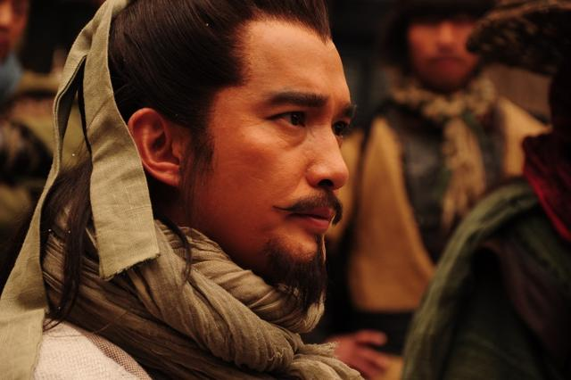

在今年八月份开学来上海时，因飞机延误，所以想读本小说聊作消遣，思前想后选择了《封神演义》，读了三四章，突然想到既然同为古典小说，为什么这本书不能名列四大名著之一呢？于是我便带着问题来到知乎搜索相关回答。只见很多人说《封神演义》一书的故事性虽好，但是文学性不佳，有很多诸如“人物性格千篇一律”、“情节大量雷同”的硬伤，而各位知友在理性讨论《封神演义》不足的同时，也浓墨重彩地推荐了《水浒传》一书。我心想四大名著，尤其是《水浒传》的电视剧虽已看过，各个人物的主要事迹也都记得很清楚，但是却没有系统地读过一遍，况且我之前也先入为主地认为《红楼梦》是当之无愧地四大名著之首，如若不拜读一下同为四大名著的《水浒传》，这又怎说得过去？本着好奇而又严谨的精神，我开始了我在微信读书上的《水浒传》阅读之旅。

# 一百零八魔头的设定

之前没看过《水浒传》的人，断断是不知道“一百零八魔头”这样一个设定的。我觉得这样来对人物背景进行设置其实是施老先生的三种考虑：

- 从开头洪太尉引出，将宋江等一百零八人打上“魔头”的标签，防止这本书在当时的社会情况下被和谐，这是第一种考虑；
- 将宋江等一百零八人打上魔头的标签，也说明了施老先生刻意把自己塑造成为一个“叙述者”、“旁观者”，纵然你宋江再怎么打着“替天行道”的大旗，但这并不代表我施耐庵完全认同你们的所作所为，这是第二种考虑；
- 将宋江等人称为魔头，叙述中却一再强调这伙人的忠义，后来被招安后洗白，然后再称拥有相同发迹轨迹的田虎、王庆、方腊等人为新的“魔头”，俨然站在了人民的对立面，这是整本书对当时荒唐官场的一种暗讽。

# 关于天杀星李逵的反思

从上面第二条出发，便可以顺理成章地引出关于整本书中杀人狂魔天杀星黑旋风李逵的讨论反思。李逵是北宋时期江州人（江西南昌一带），古人喜爱在人名前冠以地域加以区分，所以书中有时也会称他为“江州李逵”。李逵的首次出场就给人“眼前一亮”的感觉：

> 酒保道：“小人这里只卖羊肉，却没牛肉。要肥羊尽有。”[李逵](https://baike.baidu.com/item/李逵)听了，便把鱼汁[劈脸](https://baike.baidu.com/item/劈脸)泼将去，淋那酒保一身。

在酒店里撒泼还不算，还到江边明目张胆地抢鱼：

> 那七八十渔人都奔上船，把竹篙来打李逵。李逵大怒，焦躁起来，便脱下布衫，里面单单系着一条棋子布捎儿，见那乱竹篙打来，两只手一驾，早抢了五六条在手里，一似扭葱般都扭断了。渔人看见，尽吃一惊，却都去解了缆，把船撑开去了。李逵忿怒，赤条条地拿两截折竹篙，上岸来赶打，行贩都乱纷纷地挑了担走。

后面还有很多动不动就杀人的情节，比如杀掉小衙内逼美髯公朱仝上山，因罗真人不让公孙胜入伙就拿斧头去劈，这样的人物性格怎么也和“替天行道”联想不到一起。所以我觉得这算是施老先生留给各位看客的一双眼睛，各位看客可以通过这双眼睛窥到既然李逵这样都算得上是好汉，那宋江一伙人所高举的所谓替天行道的旗帜，是不是一种道德绑架，其更深层的含义又是什么？

# 关于道德、法律的反思

我一直坚信这样一句话：

> 道德是用来约束自己的，约束别人的不是道德，是法律。

最近在看的黄仁宇所著的《万历十五年》一书，也从侧面印证了我的看法：

> 中国两千年来，以道德代替法制，至明代而极，这就是一切问题的症结。

所以很多时候道德不但起不到好的作用，反而会成为恶行的包庇者。首先，道德是主观的东西，而法律则是客观的东西，古往今来，以主观的东西来代替客观的东西，带来的都是历史的倒退。比如宋江等人有时滥杀无辜，强行剥夺他人的生命权，并将其美化为所谓的虚无的道德元素：“义”。比如书中的田虎、王庆、方腊等人，因生活不济或屡遭陷害而起义，却被遮蔽天日，壅塞门路的奸臣们称为“谋反”。“谋反”与“起义”虽指同一事物，却披上了不同的道德外衣，不加分辨的人很容易顾此失彼，被表面文章蒙蔽了双眼。

当然，道德不尽是坏的，而法律也未见得事事都好。马克思、恩格斯在《共产党宣言》中揭露资产阶级法的本质时指出：

> 法律是统治阶级意志的体现。

这话说的没错，另有法国作家阿纳托尔·法郎士于1894年说：

> 在法律崇高的平等之下, 其同时禁止富人和穷人睡在桥下、在街上乞讨和偷一 块面包。

说白了，法律体现了统治阶级的意志，而统治阶级到底是哪个阶级，值得我们思考和回味。

同样，我判断一个政权是不是反动政权的标准也只有一个，那便是这个政权代替的到底是少数人的利益，还是广大的多数人的利益，这的确也是一个值得深思的问题。

# 关于佛道元素及鲁智深“见信而寂”的反思

昨日读完了水浒传，今日仔细回味来，倒有几声唏嘘。

水浒传中印象最深的便是鲁智深圆寂时的评诗了：

> 宋江等人受招安后，鲁智深陪同宋江再次上五台山，见礼智真长老。临走赠四句偈言：“逢夏而擒，遇腊而执。听潮而圆，见信而寂。”

前两句自不必说，指的便是鲁智深在万松林里活捉夏侯成，在征讨方腊时活捉方腊的故事。后两句也便是鲁智深在浙江听到潮信时圆寂的故事：

> 平生不修善果，只爱杀人放火。忽地顿开金绳，这里扯断玉锁。咦！钱塘江上潮信来，今日方知我是我。

*今日方知我是我。*

而玄奘所译《般若波罗蜜多心经》的第一句便是：

> 观自在菩萨，行深般若波罗蜜多时，照见五蕴皆空。

做菩萨难，做成一位**观自在**菩萨，能够**知我是我**的菩萨更难。

祝大家国庆节快乐！